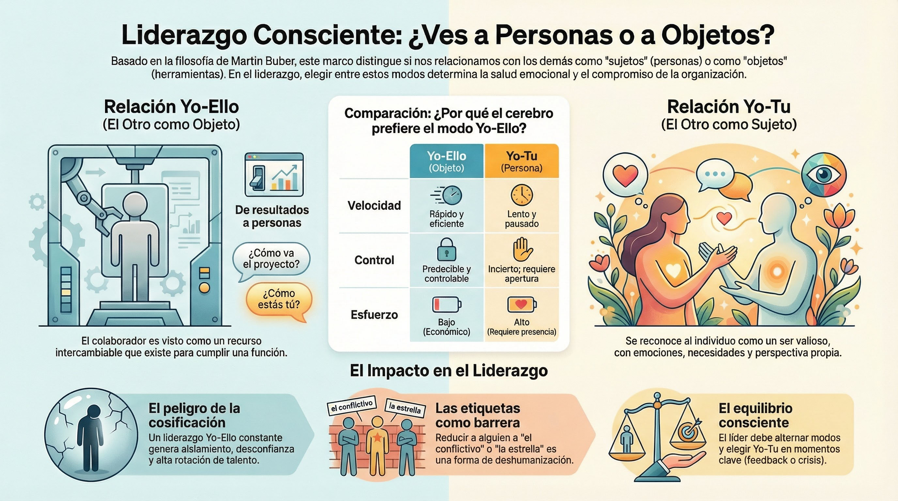

# Tema 4: Yo-Tu vs. Yo-Ello

- [Por que este tema es necesario](#por-que-este-tema-es-necesario)
	- [Como veo al otro: como sujeto o como objeto](#como-veo-al-otro-como-sujeto-o-como-objeto)
- [1. La distincion de Buber](#1-la-distincion-de-buber)
	- [1.1 Relacion Yo-Ello](#11-relacion-yo-ello)
	- [1.2 Relacion Yo-Tu](#12-relacion-yo-tu)
- [2. Por que tendemos al Yo-Ello](#2-por-que-tendemos-al-yo-ello)
- [3. El problema del liderazgo Yo-Ello](#3-el-problema-del-liderazgo-yo-ello)
- [4. El liderazgo Yo-Tu](#4-el-liderazgo-yo-tu)
- [5. El equilibrio necesario](#5-el-equilibrio-necesario)
- [Conexiones](#conexiones)
- [Dimension experiencial](#dimension-experiencial)
- [Referencias incluidas](#referencias-incluidas)
- [Material adicional del tema](#material-adicional-del-tema)
	- [Infografías del tema](#infografías-del-tema)

---
## Por que este tema es necesario

#### Como veo al otro: como sujeto o como objeto

**Pregunta que responde:**
Como veo al otro: como sujeto o como objeto?

#grafica  Cubo metálico (objeto rígido) junto a esfera orgánica de arcilla: metáfora visual de Yo-Ello vs Yo-Tú

Este tema introduce la distincion fundamental de Martin Buber: hay dos modos de relacionarse con el otro. Este marco etico prepara para T5 (compasion sabia) y T6 (comunicacion consciente).

---

## 1. La distincion de Buber

Martin Buber (1923)[^1] distinguio dos modos de relacion:

#grafica  Silueta gris "Objeto: un medio para un fin" vs rostro real "Sujeto: un individuo completo"

### 1.1 Relacion Yo-Ello

#imagen  Persona en traje con caja abierta en lugar de cabeza: el otro reducido a su función (Yo-Ello)

El otro es visto como **objeto**:
- Existe para cumplir una funcion
- Reducido a su rol o resultados
- Medio para un fin
- Intercambiable

### 1.2 Relacion Yo-Tu

#imagen  Dos rostros mirándose con presencia: el encuentro genuino de la relación Yo-Tú

El otro es visto como **sujeto**:
- Individuo completo con identidad propia
- Tiene emociones, necesidades, perspectiva
- Valioso en si mismo
- Insustituible

#ejemplo 
**Yo-Ello
- Un lider que interactua con colaboradores solo desde el interes en sus resultados
- Preguntar "Como va el proyecto?" sin preguntar "Como estas tu?"
- Ver al equipo como "recursos humanos" (la palabra ya indica cosificacion)
- Evaluar a alguien solo por lo que produce
**Yo-Tu
- Conversar mostrando interes genuino en la perspectiva del otro
- Reconocer al otro como persona antes que como rol
- Escuchar para entender, no solo para responder
- Valorar la presencia del otro, no solo su productividad

---

## 2. Por que tendemos al Yo-Ello

#grafica  Baterías: Yo-Ello 99% (bajo costo) vs Yo-Tú 10% (alto costo energético, requiere presencia total)

La relacion Yo-Ello es mas facil y eficiente:

| Yo-Ello | Yo-Tu |
|---------|-------|
| Rapido | Lento |
| Predecible | Incierto |
| Controlable | Requiere apertura |
| Protege de la vulnerabilidad | Expone |

El Sistema 1 (M1) prefiere Yo-Ello porque es mas economico.

#grafica  Diagrama bifurcado: sin espacio → reacción Yo-Ello ("juicio inmediato") vs con espacio → elección Yo-Tú ("curiosidad")

La relacion Yo-Tu requiere presencia, atencion, disponibilidad. Es costosa.

---

## 3. El problema del liderazgo Yo-Ello

Cuando un lider opera predominantemente en modo Yo-Ello:

**Para el lider
- Aislamiento
- Desconexion de la realidad del equipo
- Decisiones que ignoran el factor humano

**Para el equipo
- Sensacion de no ser visto
- Desmotivacion
- Desconfianza
- Rotacion

**Para la organizacion
- Cultura transaccional
- Falta de compromiso
- Perdida de talento

---

## 4. El liderazgo Yo-Tu

#grafica  Tres mitos tachados: "Ser blando", "Evitar decisiones difíciles", "Olvidar los resultados"

No significa:
- Ser blando
- Evitar decisiones dificiles
- Olvidar los resultados

Significa:
- Ver al otro como persona mientras tomas decisiones
- Comunicar con respeto incluso cuando el mensaje es duro
- Reconocer el impacto humano de las decisiones

---

## 5. El equilibrio necesario

La relacion pura Yo-Tu todo el tiempo es insostenible. Requeriria presencia total constante.

#grafica  Llave metálica (Yo-Ello, tóxico si permanente) vs rama orgánica (Yo-Tú, insostenible si permanente): el equilibrio consciente

La relacion pura Yo-Ello todo el tiempo es deshumanizante.

El lider consciente:
- Reconoce cuando esta en modo Yo-Ello
- Puede alternar deliberadamente
- Elige Yo-Tu en momentos clave (conversaciones dificiles, feedback, crisis)

---

## Conexiones

**Conexion con los sesgos (T2)

El etiquetado (T2) es una forma de Yo-Ello:

- "El conflictivo" → ya no es una persona, es una etiqueta
- "La estrella" → tambien es reduccion, aunque positiva

Los sesgos interpersonales facilitan la cosificacion.

**Conexion con M3

El espacio entre estimulo y respuesta (M3) permite elegir el modo de relacion:

1. Alguien hace algo que me molesta
2. **Sin espacio:** Reacciono desde Yo-Ello ("este tipo es imposible")
3. **Con espacio:** Puedo elegir Yo-Tu ("esta persona tiene una perspectiva que no entiendo")

---

## Dimension experiencial #insight

Reflexiona:

- Con quien de tu equipo tiendes a relacionarte en modo Yo-Ello?
- Hay alguien que hayas reducido a una etiqueta?
- Cuando fue la ultima vez que te relacionaste en modo Yo-Tu autentico?

El lider modela el modo de relacion para el resto de la organizacion.

---

## Referencias incluidas
[^1]: Martin Buber (1923). *Yo y Tu* (Ich und Du). Obra filosófica sobre los dos modos fundamentales de relación.

**Otras posibles referencias de interés
- Buber, M. (1923). *Yo y Tu.* (Ich und Du)
- Scharmer, O. (2009). *Theory U: Leading from the Future as It Emerges.* Berrett-Koehler.
- Hougaard, R. & Carter, J. (2022). *Compassionate Leadership.* Harvard Business Review Press.

---
## Material adicional del tema #aux
### Infografías del tema 

#infografia  Filosofía de Buber aplicada al liderazgo: relación Yo-Tú vs Yo-Ello, comparación cerebral y equilibrio consciente