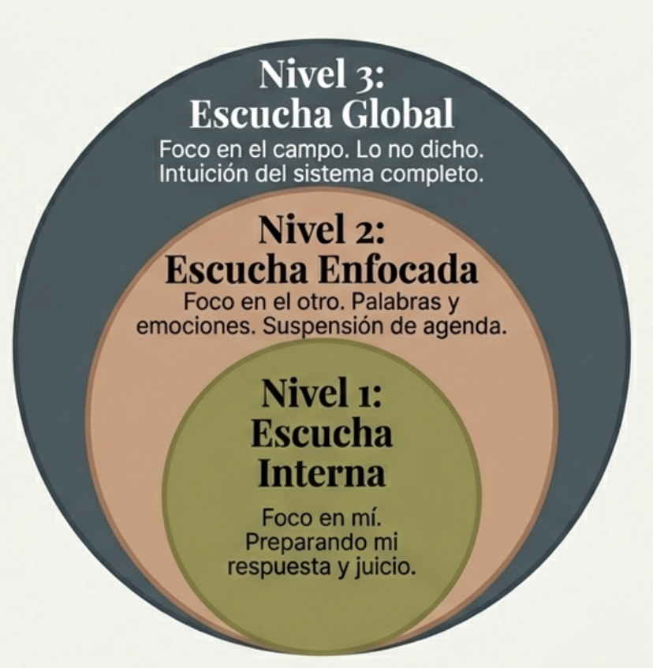
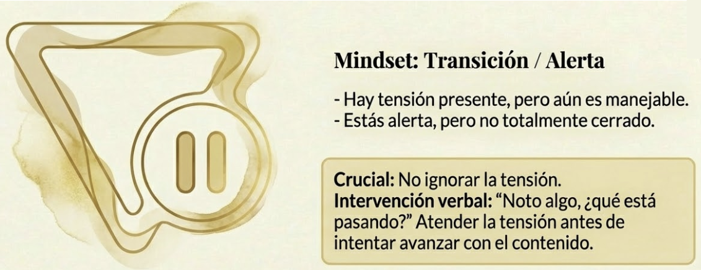
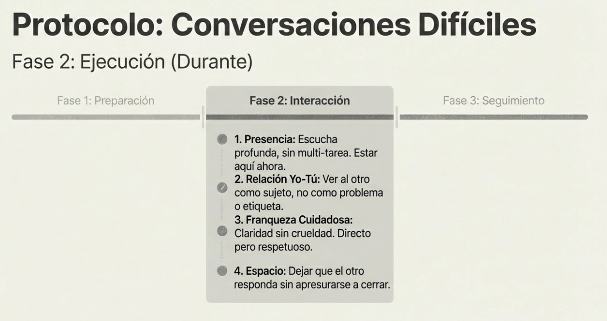
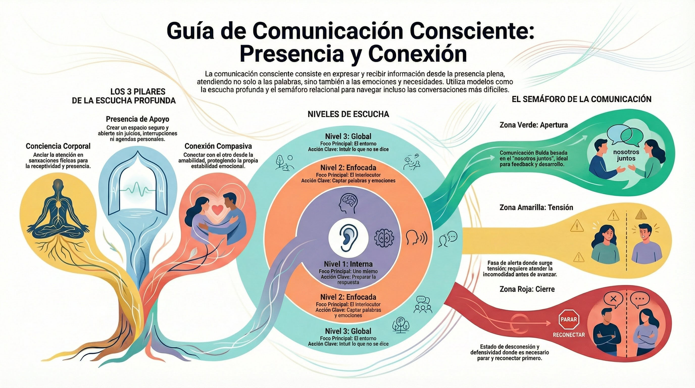

# Tema 6: Comunicacion consciente

#imagen  Dos perfiles frente a frente con flechas bidireccionales: flujo verbal y no verbal de la comunicación

- [Por que este tema es necesario](#por-que-este-tema-es-necesario)
	- [Aplicando la consciencia a las conversaciones](#aplicando-la-consciencia-a-las-conversaciones)
- [1. Fundamentos de la comunicación consciente](#1-fundamentos-de-la-comunicación-consciente)
- [2. La escucha profunda](#2-la-escucha-profunda)
- [3. El semaforo de la comunicacion](#3-el-semaforo-de-la-comunicacion)
	- [Protocolo para conversaciones dificiles](#protocolo-para-conversaciones-dificiles)
- [Conexiones](#conexiones)
- [Dimension experiencial](#dimension-experiencial)
- [Referencias incluidas](#referencias-incluidas)
- [Material adicional del tema](#material-adicional-del-tema)
	- [Infografías del tema](#infografías-del-tema)

---

## Por que este tema es necesario

#### Aplicando la consciencia a las conversaciones

**Pregunta que responde:**
Como aplico todo esto en las conversaciones del dia a dia?

Este tema cierra el modulo con aplicacion practica. Las herramientas de consciencia relacional se traducen en comunicacion concreta: escucha profunda, el semaforo verde/amarillo/rojo, y protocolos para conversaciones dificiles.

---

## 1. Fundamentos de la comunicación consciente

Comunicar conscientemente es expresar y recibir información desde la presencia: atención al mensaje verbal, pero también a las emociones y necesidades que lo sostienen.

#grafica  Comunicación habitual (reactiva, solo verbal) vs consciente (presencia + emociones + necesidades)

**Establecer la intención** marca la dirección interna de una conversación. Ese anclaje mantiene las palabras y actitudes alineadas con lo que se busca lograr —claridad, respeto, comprensión genuina.

La comunicación consciente exige **presencia plena** durante la interacción: escuchar sin juzgar, expresarse con claridad y consideración. El foco no está solo en las palabras, sino en comprender las emociones, intenciones y necesidades detrás del mensaje.

#grafica  Tres columnas: Establecer Intención, Presencia Plena y Base Somática

---
## 2. La escucha profunda

#grafica  Diagrama de Venn[^1]: Conciencia Corporal + Presencia de Apoyo + Conexión Compasiva = Escucha Profunda

Este modelo va más allá de captar información: busca comprender el flujo completo de la comunicación, verbal y no verbal. Parte de una premisa: la capacidad de escucha profunda es innata y puede cultivarse mediante práctica y consciencia.

El modelo se compone de tres habilidades centrales interconectadas:

#grafica  Tres cartas: Conciencia Corporal (El Ancla), Presencia de Apoyo (El Espacio), Conexión Compasiva (El Vínculo)

**1. Conciencia corporal:** Utiliza el "centro de escucha" —un punto físico en el cuerpo como abdomen, corazón o garganta— donde anclar la atención y expandirla hacia el hablante. La conciencia corporal transforma el cuerpo en instrumento de escucha. Prestar atención a las sensaciones físicas, la postura y la respiración ancla la presencia y la receptividad. Sin esa consciencia, los pensamientos y emociones internas capturan la atención y la conexión con el hablante se pierde.

**2. Presencia de apoyo:** Cultivar una actitud abierta y receptiva hacia quien habla. Crear un espacio seguro donde la otra persona se sienta escuchada y comprendida, sin juicios ni interrupciones. Requiere paciencia, confianza y tolerancia a la incertidumbre, permitiendo que el proceso de escucha se desarrolle naturalmente. La presencia de apoyo opera desde la atención abierta: estar presente con lo que surge en el campo de escucha —comunicación verbal y no verbal— sin intentar dirigir ni controlar la conversación.

**3. Conexión compasiva:** Introduce la dimensión de la compasión en la escucha. Conectar con el sufrimiento del hablante —y con el propio— desde la amabilidad y la comprensión. La conexión compasiva no busca solucionar los problemas del otro, sino ofrecer presencia empática que permita explorar sentimientos y experiencias propias. La compasión protege del agotamiento por empatía: mantiene la estabilidad emocional propia mientras se conecta con el sufrimiento del otro.

**Tres niveles de escucha

#grafica  Círculos concéntricos: Nivel 1 Interna (foco en mí) → Nivel 2 Enfocada (foco en el otro) → Nivel 3 Global (lo no dicho)

**Nivel 1: Escucha interna**
- Escuchas mientras piensas en tu respuesta
- Filtras por lo que es relevante para ti
- Esperas tu turno para hablar

**Nivel 2: Escucha enfocada**
- Atencion en el otro
- Captas palabras y emociones
- Suspendes tu agenda

**Nivel 3: Escucha global**
- Atencion en el otro y en el campo
- Captas lo que no se dice
- Intuyes el sistema completo

El liderazgo consciente requiere al menos Nivel 2, y cultivar Nivel 3.

---

## 3. El semaforo de la comunicacion

La comunicación de zona verde es un enfoque desarrollado por Susan Gillis Chapman[^2]. Integra los principios de atención plena en las interacciones diarias, transformando conversaciones cotidianas en práctica de consciencia.

#grafica  Tres zonas del semáforo: Verde (Fluidez/Nosotros), Amarillo (Transición/Alerta), Rojo (Cierre/Yo)

El **modelo del semáforo** captura la dinámica de apertura y cierre en la comunicación:

**Zona verde

#grafica  Zona verde: mindset "Nosotros juntos", conexión y confianza, momento ideal para feedback y temas difíciles

Comunicación fluida y abierta. Presencia y conexión con uno mismo y con los demás. Predomina la intención de "Nosotros juntos" —la conversación fluye con facilidad y los temas difíciles se abordan con respeto y apertura.

- Conexion establecida
- Confianza presente
- Apertura mutua
- Posibilidad de conversaciones profundas

**Que hacer:** Aprovechar para temas importantes, feedback, desarrollo.

**Zona amarilla

#grafica  Zona amarilla: transición/alerta, tensión manejable; crucial no ignorar e intervenir antes del bloqueo

Fase de transición entre apertura y cierre. A menudo pasa desapercibida, pero es el punto crucial para reconocer señales de tensión e intervenir antes de que la comunicación se bloquee.

- Tension presente pero manejable
- Alerta pero no cerrado
- Necesita cuidado

**Que hacer:** Atender la tension antes de avanzar. Preguntar: "Noto algo, que esta pasando?"

**Zona roja

#grafica  Zona roja: mindset "Yo primero" (defensa), desconexión total; regla de oro: PARAR y reconectar

Estado de cierre. La comunicación se ha detenido. Se erigen barreras entre nosotros y los demás; la intención se centra en "Yo primero". Estado inconsciente donde se deja de escuchar con atención y pueden aparecer comportamientos defensivos o agresivos.

- Desconexion
- Defensividad activa
- Cerrado
- Cualquier cosa que digas sera usada en tu contra

**Que hacer:** No intentar conversaciones importantes. Primero, reconectar.

---

#practica 

#### Protocolo para conversaciones dificiles

#grafica  Protocolo conversaciones difíciles — Fase 1 Preparación: pausa 3 min, clarificar intención, anticipar perspectiva
#grafica  Protocolo — Fase 2 Interacción: presencia, relación Yo-Tú, franqueza cuidadosa, espacio para el otro
#grafica  Protocolo — Fase 3 Cierre: acuerdos claros, recuperación y cerrar el ciclo (M4)

**Antes

1. **Pausa de 3 minutos (M4)**
   - Notar tu estado
   - Regular si es necesario
   - No entrar activado

2. **Clarificar intencion**
   - Que quiero lograr?
   - Cual es mi intencion genuina?
   - Es momento adecuado?

3. **Anticipar la perspectiva del otro**
   - Que podria estar sintiendo?
   - Que le importa?
   - Que sesgos (T2) podrian estar operando en mi?

**Durante

1. **Presencia (T5: caring presence)**
   - Estar aqui ahora
   - Escucha profunda
   - Sin multi-tarea

2. **Yo-Tu (T4)**
   - Ver al otro como sujeto
   - No reducir a la etiqueta o al problema

3. **Franqueza cuidadosa (T5: caring candour)**
   - Directo pero respetuoso
   - Claridad sin crueldad
   - Ir al punto

4. **Espacio para el otro**
   - Dejar que responda
   - Escuchar la respuesta
   - No apresurarse a cerrar

**Despues

1. **Cierre claro**
   - Que acordamos?
   - Cual es el siguiente paso?
   - Hay algo pendiente?

2. **Recuperacion**
   - Las conversaciones dificiles gastan recursos
   - Cerrar el ciclo (M4)

---

## Conexiones

**Conexion con M3

M3 enseno el espacio entre estimulo y respuesta.

En conversaciones dificiles:
- El otro dice algo que te activa
- **Sin espacio:** Reaccionas
- **Con espacio:** Eliges tu respuesta

El espacio de M3 es crucial para la comunicacion consciente.

**Conexion con M4

M4 introdujo la pausa de 3 minutos.

Aplicada a comunicacion:
- Antes de reuniones dificiles
- Cuando notas que te activas durante la conversacion
- Despues, para cerrar el ciclo

**Conexion con T1-T5

La comunicacion consciente integra todo M5:

| Tema | Aplicacion en comunicacion |
|------|---------------------------|
| T1: Conexion | El contagio emocional opera en cada conversacion |
| T2: Sesgos | Los sesgos distorsionan lo que oigo |
| T3: Autocompasion | Base para no reaccionar defensivamente |
| T4: Yo-Tu | Ver al otro como persona, no como problema |
| T5: Compasion sabia | Directo y humano a la vez |

---

## Dimension experiencial #insight

Reflexiona:

- En que nivel de escucha sueles operar?
- Reconoces las zonas verde/amarillo/rojo en tus conversaciones?
- Que conversacion dificil tienes pendiente? Como podrias prepararla?

La comunicacion del lider modela la comunicacion organizacional:

| Lider que modela | Cultura resultante |
|------------------|-------------------|
| Escucha profunda | Equipo que escucha |
| Franqueza cuidadosa | Feedback frecuente |
| Conversaciones dificiles a tiempo | Problemas resueltos temprano |
| Zonas verdes cultivadas | Confianza sistemica |

---
## Referencias incluidas
[^1]: The Deep Listening Model. Modelo de escucha profunda centrada en la consciencia.
[^2]: Susan Gillis Chapman. Autora y maestra budista, creadora del modelo de comunicación de zona verde.

**Otras posibles referencias de interés
- Scharmer, O. (2009). *Theory U: Leading from the Future as It Emerges.* Berrett-Koehler.
- Stone, D., Patton, B. & Heen, S. (2010). *Difficult Conversations.* Penguin.
- Rosenberg, M. (2015). *Nonviolent Communication.* PuddleDancer Press.

---
## Material adicional del tema #aux
### Infografías del tema 

#infografia  Escucha profunda (3 pilares, niveles) y semáforo relacional para comunicación con presencia