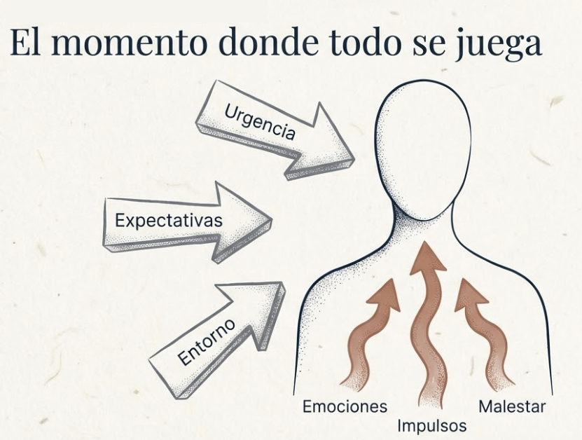
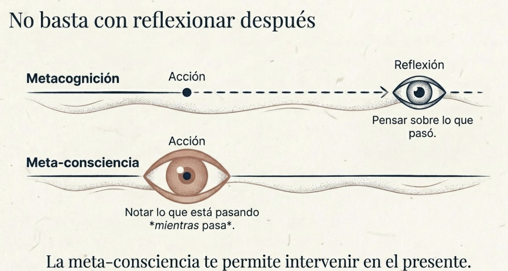
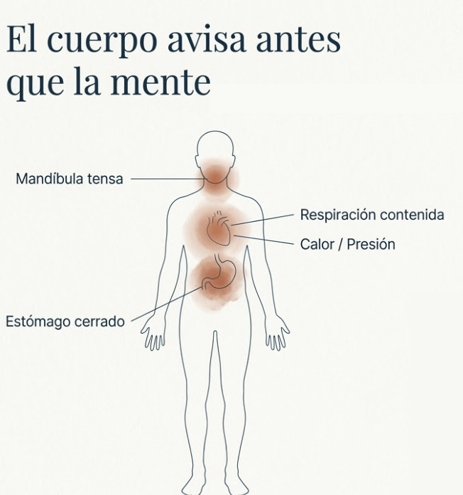
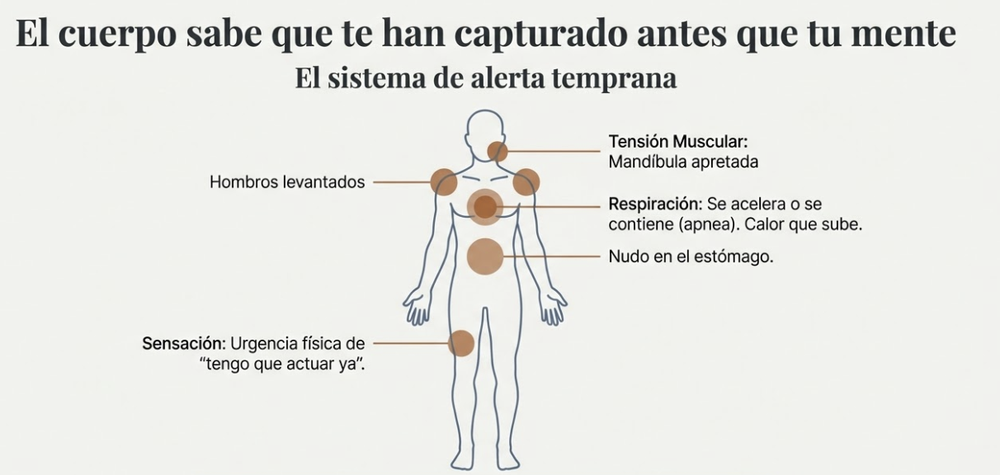
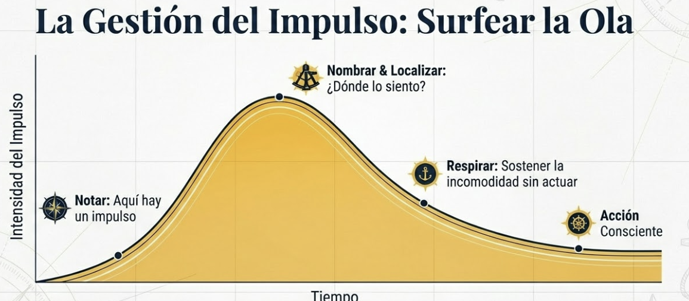
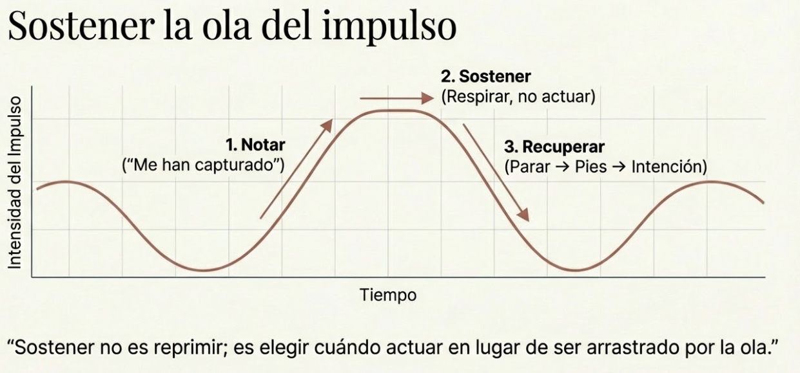
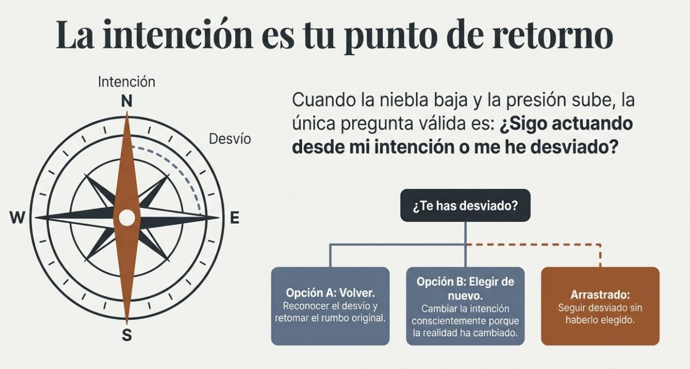
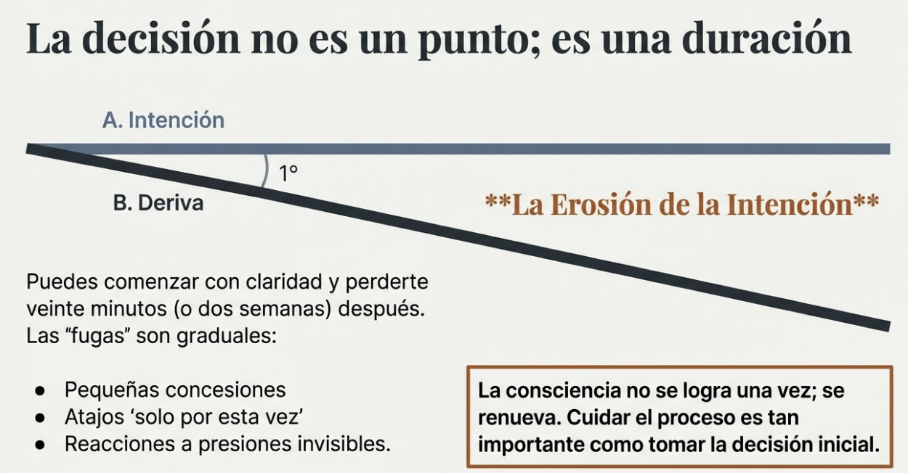
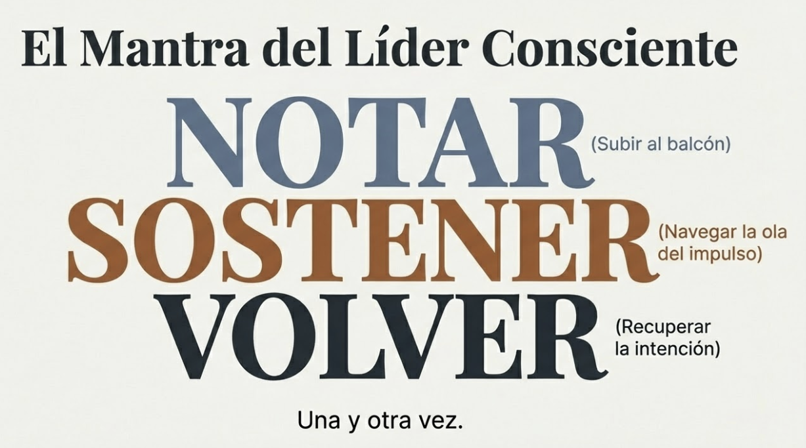

# Tema 2: Decidir sin ser arrastrado

#imagen  Vórtice abstracto marrón y gris: fuerzas que arrastran en el momento de decidir

- [Por que este tema es necesario](#por-que-este-tema-es-necesario)
	- [DURANTE: Sostener la consciencia cuando todo empuja hacia la reaccion](#durante-sostener-la-consciencia-cuando-todo-empuja-hacia-la-reaccion)
- [1. El momento donde todo se juega](#1-el-momento-donde-todo-se-juega)
- [2. Notar que está pasando mientras pasa](#2-notar-que-está-pasando-mientras-pasa)
- [3. El balcón y la pista](#3-el-balcón-y-la-pista)
- [4. El cuerpo como sistema de alerta temprana](#4-el-cuerpo-como-sistema-de-alerta-temprana)
- [5. Sostener sin actuar automáticamente](#5-sostener-sin-actuar-automáticamente)
- [6. La intención como punto de retorno](#6-la-intención-como-punto-de-retorno)
- [7. Cuando ya te han capturado](#7-cuando-ya-te-han-capturado)
- [8. Sostener la consciencia a lo largo del proceso](#8-sostener-la-consciencia-a-lo-largo-del-proceso)
- [9. Lo diferencial de este enfoque](#9-lo-diferencial-de-este-enfoque)
- [Práctica: El ritmo de la consciencia sostenida](#práctica-el-ritmo-de-la-consciencia-sostenida)
- [Conexiones](#conexiones)
- [Dimensión experiencial](#dimensión-experiencial)
- [Referencias](#referencias)
- [Material adicional del tema](#material-adicional-del-tema)
	- [Infografías del tema](#infografías-del-tema)

---

## Por que este tema es necesario

#### DURANTE: Sostener la consciencia cuando todo empuja hacia la reaccion

**Pregunta que responde:**
Como mantengo la consciencia en el momento de decidir — y como la sostengo a lo largo del proceso para no perderme?

Este tema aborda el momento critico: cuando estas dentro de la decision y las fuerzas de captura operan. La preparacion del T1 se pone a prueba aqui. Sin la capacidad de sostener consciencia en el momento, incluso la mejor intencion se pierde.

La meta-consciencia — observarte mientras actuas — es lo que distingue al lider que decide del lider que es decidido por sus automatismos.

---

## 1. El momento donde todo se juega

#grafica  Silueta con fuerzas externas (urgencia, expectativas, entorno) e internas (emociones, impulsos, malestar)

Te has preparado. Sabes qué quieres y desde dónde quieres actuar (T1, Parte 1). Has ampliado tu campo para ver lo que normalmente no ves (T1, Parte 2). Pero ahora estás dentro del momento — la conversación difícil, la negociación, la reunión donde hay que decidir.

Y aquí es donde la preparación se pone a prueba. Porque en el momento de decidir hay fuerzas que quieren decidir por ti. Fuerzas internas: emociones intensas, impulsos, malestar que pide resolución inmediata. Fuerzas externas: urgencia, expectativas de otros, presión del entorno.

Esas fuerzas no esperan. No te piden permiso. Operan rápido, y si no las notas, deciden antes de que tú elijas.

En M1 aprendiste que tu mente opera con automatismos. En M3 aprendiste a crear espacio entre estímulo y respuesta. Ahora ves esos automatismos en acción, en el momento real de la decisión — y necesitas sostener ese espacio cuando todo empuja hacia la reacción.

---

## 2. Notar que está pasando mientras pasa

Hay una diferencia crucial entre dos capacidades:[^1]

**Metacognición:** Pensar sobre lo que pasó. Después de la reunión, reflexionas: "¿Por qué reaccioné así?"

**Meta-consciencia:** Notar lo que está pasando mientras pasa. Durante la reunión, notas: "Estoy reaccionando con intensidad. ¿Qué está ocurriendo?"

#grafica  Opción 1: No basta con reflexionar después — metacognición vs meta-consciencia

#grafica  Opción 2: Pensar después vs notar ahora — pasado vs presente con flechas temporales
La metacognición te ayuda a aprender del pasado. La meta-consciencia te permite intervenir en el presente.

Esta capacidad de observarte mientras actúas es lo que distingue al líder que decide del líder que es decidido por sus automatismos. No es pensar más rápido. Es estar presente con lo que ocurre — en ti y en la situación — mientras ocurre.

---

## 3. El balcón y la pista

#grafica  Opción 1: Ilustración artística del balcón (observación arriba) y la pista (bailarines abajo)

#ppt  Opción 2: Consciencia dual: el balcón y la pista de baile — vista isométrica con texto

Ronald Heifetz[^2] ofrece una metáfora útil para algo tan abstracto: el balcón y la pista de baile.

Imagina que estás bailando en una pista. Estás inmerso en la acción — los movimientos, la música, las otras personas. Ves lo que tienes delante, reaccionas a lo que viene.

Ahora imagina que, sin dejar de bailar, pudieras también observar desde un balcón. Desde ahí verías patrones que desde la pista son invisibles: cómo se mueve el grupo, dónde hay tensión, qué dinámicas se están formando.

El líder consciente hace ambas cosas simultáneamente. Está en la acción — participando, decidiendo, respondiendo. Y mantiene un hilo de atención desde el balcón — observando qué está pasando, qué le está pasando, qué fuerzas están operando.

Esta "consciencia dual" es la meta-consciencia aplicada:

**Atención interna:** ¿Qué estoy sintiendo? ¿Qué impulso está apareciendo? ¿Qué me está empujando?

**Atención externa:** ¿Qué está pasando en la situación? ¿Qué necesita el momento? ¿Qué no estoy viendo?

No es fácil. Requiere práctica. Pero es entrenable — y es exactamente lo que entrena la práctica de Open Monitoring que acompaña este módulo.

---

## 4. El cuerpo como sistema de alerta temprana

#ppt  Opción 1: El cuerpo avisa antes que la mente — mandíbula, respiración, calor, estómago

#ppt  Opción 2: El sistema de alerta temprana — tensión muscular, hombros, respiración, nudo, urgencia

En M2 aprendiste que el cuerpo es fuente de información. Aquí esa información se vuelve crucial: el cuerpo te avisa antes que la mente de que algo te está capturando.

**Señales de que una fuerza está tomando el control:**

- Respiración que se acelera o se contiene
- Tensión en mandíbula, hombros, estómago
- Sensación de urgencia física, de "tengo que actuar ya"
- Calor que sube, presión en el pecho
- Impulso de interrumpir, de defender, de cerrar

Estas señales no son el problema. Son información. Te dicen: "Algo está operando. Presta atención."

Si las ignoras, el automatismo decide. Si las notas, tienes opción.

El cuerpo no es solo un sistema de alerta puntual. Es tu ancla constante durante todo el DURANTE. Mientras la mente puede perderse en el contenido de la conversación, el cuerpo sigue registrando lo que realmente está pasando en ti. Mantener un hilo de atención en el cuerpo — no solo en el balcón mental — te da información continua sobre tu estado.

---

## 5. Sostener sin actuar automáticamente

#grafica  Opción 1: Surfear la Ola — curva dorada con 4 fases: notar, nombrar, respirar, acción consciente

#ppt  Opción 1: El Arte de Sostener — sostener ≠ reprimir, umbral de acción automática

#ppt  Opción 2: Sostener: "Te veo, pero voy a esperar" — impulso como ola, libertad de elección

#grafica  Opción 2: Sostener la ola del impulso — ola sinusoidal con 3 pasos: notar, sostener, recuperar
Notar no es suficiente. Puedes notar perfectamente que un impulso te está empujando — y actuar igual. El paso siguiente es **sostener**: no ceder automáticamente al impulso.

Sostener no es reprimir. No es forzarte a no actuar. Es reconocer que tienes un impulso y elegir no seguirlo todavía. Es decirle al impulso: "Te veo. Pero voy a esperar."

Esto genera malestar. El cuerpo estaba preparado para actuar, y no actuar produce tensión. Esa incomodidad no significa que estés haciendo algo mal. Significa que estás ejercitando una capacidad que requiere esfuerzo.

**El impulso es como una ola.** Sube, alcanza un pico, y baja. Si no actúas, eventualmente pasa. No tienes que luchar contra él; solo tienes que no subirte automáticamente.

**Cuando notes un impulso intenso:**

1. **Nómbralo:** "Hay un impulso de interrumpir / defender / decidir ya."
2. **Localízalo en el cuerpo:** ¿Dónde lo sientes? ¿Cómo es la sensación?
3. **Respira con él:** No para eliminarlo. Para acompañarlo mientras sube y baja.
4. **Observa cómo cambia:** La intensidad no es constante. Varía. Pasa.
5. **Elige:** Cuando el impulso ha bajado, decide si actuar o no desde un lugar más amplio.

El objetivo no es nunca actuar. Es elegir cuándo actuar en lugar de ser arrastrado.

---

## 6. La intención como punto de retorno

#ppt  Opción 1: La Intención como Punto de Retorno — brújula en la niebla

#ppt  Opción 2: Rosa de los vientos con opciones: volver, elegir de nuevo, arrastrado

En el Tema 1 clarificaste tu intención: qué quieres conseguir y desde dónde quieres actuar. Esa intención no era un ejercicio previo que ya cumplió su función. Es tu punto de retorno durante todo el proceso.

Cuando notes que algo te ha capturado, la pregunta no es "¿qué debería hacer?" — eso te lleva al análisis paralizado. La pregunta es: **"¿Sigo actuando desde mi intención o me he desviado?"**

Si te has desviado, tienes dos opciones legítimas:

- **Volver a la intención original.** Reconoces la desviación y retomas el rumbo que habías elegido.
- **Elegir conscientemente una intención diferente.** La situación ha revelado algo que no veías; decides ajustar tu intención desde la claridad, no desde la captura.

Lo que no es legítimo es seguir desviado sin haberlo elegido. Eso es ser decidido por las fuerzas, no decidir.

La intención funciona como brújula precisamente porque no te dice qué hacer en cada momento. Te dice hacia dónde ibas, para que puedas notar cuándo ya no vas hacia allí.

---

## 7. Cuando ya te han capturado

#ppt  Cuando ya te han capturado: ciclo reconoce → para → cuerpo → retoma

A veces no notas a tiempo. El impulso fue más rápido, la emoción más intensa, la presión demasiado fuerte. Ya reaccionaste. Ya dijiste algo que no querías decir. Ya tomaste una dirección que no habías elegido conscientemente.

Esto va a pasar. No eres un monje en una cueva; eres un líder en contextos de alta presión. La captura ocasional no es fracaso; es parte del territorio.

Lo que importa es qué haces después.

**Primero: reconoce que ha pasado.** Sin drama, sin autocastigo. "Me han capturado. He reaccionado."

**Segundo: si es posible, no sigas decidiendo.** Cuando estás fuera de tu ventana de tolerancia — demasiado activado o demasiado colapsado — tu capacidad de decidir bien está comprometida. Si puedes, para. "Necesito un momento antes de continuar."

**Tercero: vuelve al cuerpo.** El camino de regreso no es mental; es somático. Siente los pies en el suelo. Suelta los hombros. Respira extendiendo la exhalación. El cuerpo regula a la mente, no al revés.

**Cuarto: retoma desde la intención.** Cuando hayas recuperado algo de espacio, vuelve a la pregunta del T1: "¿Qué quiero realmente aquí? ¿Desde dónde quiero actuar?" Quizás la intención original sigue siendo válida. Quizás necesita ajustarse. Pero decides tú, no el impulso que te capturó.

---

## 8. Sostener la consciencia a lo largo del proceso

#ppt  Opción 1: Decidir es un proceso, no un punto — fugas graduales y resiliencia consciente

#ppt  Opción 2: La decisión no es un punto; es una duración — erosión gradual de la intención

Hay algo que la formación tradicional en toma de decisiones no suele reconocer: **decidir no es un momento puntual**. Es un proceso que se extiende en el tiempo — a veces minutos, a veces días, a veces meses.

Y la consciencia no se "logra" una vez. Se renueva una y otra vez. Cada momento dentro del proceso es una nueva oportunidad de ser capturado — o de volver a elegir.

Puedes empezar una conversación difícil con toda la intención clara y, veinte minutos después, estar completamente capturado por la necesidad de ganar. Puedes tomar una decisión estratégica con lucidez y, en la implementación, ir cediendo poco a poco a presiones que erosionan la intención original.

**Las fugas son graduales.** Pequeñas desviaciones de valores que parecen insignificantes. Reacciones "comprensibles" dadas las circunstancias. Atajos que "solo por esta vez" comprometen lo que habías decidido. Y de pronto estás lejos de donde querías estar, sin un momento claro donde hayas elegido desviarte.

Por eso cuidar el proceso es tan importante como cuidar la decisión.

**Cuidar el proceso significa:**

- Volver al balcón regularmente, no solo cuando hay crisis
- Notar las pequeñas desviaciones antes de que se conviertan en grandes fugas
- Renovar la intención conscientemente: "¿Sigo queriendo lo que quería? ¿Sigo actuando desde donde quería actuar?"
- Tratarte con honestidad cuando te has desviado — sin autoengaño, pero también sin flagelación

**Resiliencia consciente** no es no caer nunca. Es volver al centro cuando te has desviado. Una y otra vez. Sin convertir cada caída en drama, pero sin normalizar la desviación como "así son las cosas".

Cada vez que vuelves, fortaleces la capacidad de volver. Cada vez que notas una fuga y la corriges, entrenas la vigilancia. El proceso no es lineal; es un continuo retorno.

---

## 9. Lo diferencial de este enfoque

La formación tradicional en liderazgo trata la decisión como un evento: analizas, decides, ejecutas. Si la decisión era buena, el resultado será bueno.

Liderar con consciencia reconoce otra cosa: **la calidad de tu presencia durante el proceso determina la calidad del resultado** — tanto o más que la calidad del análisis previo.

Puedes tener el mejor análisis y perder la consciencia en el momento. Puedes tener la intención más clara y dejar que las fugas la erosionen. Puedes saber exactamente qué quieres y ser arrastrado por lo que aparece.

Por eso este tema no te da "técnicas para decidir mejor". Te invita a habitar el proceso de decidir con consciencia sostenida. A estar en la pista y en el balcón. A notar, sostener, recuperar, volver — una y otra vez.

Eso no se aprende leyendo. Se entrena practicando.

---

## Práctica: El ritmo de la consciencia sostenida #practica

**Esta no es una técnica para usar una vez. Es una forma de estar con el proceso de decidir.**

**Antes de entrar

- Recuerda tu intención en una frase: qué quieres conseguir, desde dónde quieres actuar.
- Nota cómo está tu cuerpo: ¿hay tensión, activación, calma?
- Reconoce tu estado: ¿cómo estás llegando a este momento? ¿Qué fuerzas ya están operando?

**Durante — el ritmo de los tres segundos

#ejercicio  El Ritmo de 3 Segundos: Cuerpo, Impulso, Intención + NOTAR.SOSTENER.VOLVER

- Mantén un hilo de atención en el balcón. No constantemente — eso sería imposible — pero regularmente.
- Cada cierto tiempo, haz una pausa interna de tres segundos:

1. **Cuerpo:** ¿Qué siento físicamente? (tensión, respiración, temperatura)
2. **Impulso:** ¿Qué quiere hacer este impulso?
3. **Intención:** ¿Sigo en mi rumbo o me he desviado?

No necesitas respuestas elaboradas. Solo notar.

Mantén un hilo de atención en el cuerpo durante toda la interacción. El cuerpo te avisa antes que la mente.

**Cuando te han capturado

1. **Reconoce:** "Me han capturado."
2. **Para si puedes:** "Necesito un momento."
3. **Vuelve al cuerpo:** Pies en el suelo, hombros sueltos, exhala largo.
4. **Retoma desde la intención:** "¿Qué quería realmente aquí?"

**A lo largo del proceso

- Revisa regularmente: ¿hay fugas? ¿pequeñas desviaciones que se están acumulando?
- Renueva la intención conscientemente. No asumas que sigue vigente solo porque la declaraste al principio.
- Cuando te desvíes, vuelve. Sin drama. Con honestidad.

**El mantra del DURANTE

**Notar. Sostener. Volver.**

#ppt  El Mantra del Líder Consciente: NOTAR (balcón), SOSTENER (ola), VOLVER (intención)

**Lo que llevas al DESPUÉS

Todo lo que has notado durante el proceso — dónde mantuviste la consciencia, dónde la perdiste, qué te capturó, cuántas veces volviste — es el material con el que trabajarás en el Tema 3.

No se trata de llegar al DESPUÉS con un veredicto de "lo hice bien" o "lo hice mal". Se trata de llegar con observaciones:

- "Noté que X me capturó."
- "Pude volver cuando Y."
- "Perdí la intención en el momento Z."
- "El cuerpo me avisó pero no hice caso."
- "Esta vez sostuve el impulso más tiempo que antes."

Esas observaciones, tratadas con honestidad y sin destrucción, son las que permiten aprender.

---

## Conexiones

**Conexión con lo que viene

Has trabajado el ANTES (clarificar intención, ampliar campo) y el DURANTE (sostener consciencia, no ser arrastrado, volver cuando te capturan).

El **Tema 3** entrará en el DESPUÉS: qué hacer cuando ya has decidido. Cómo transitar las consecuencias. Cómo tratarte cuando las cosas no salen como esperabas. Cómo aprender sin flagelarte. Y cómo lo que aprendes ahí prepara el próximo ANTES.

Pero antes de llegar ahí, quédate con esto: la consciencia durante el proceso no es un lujo ni un añadido. Es lo que hace posible que tu decisión sea tuya — y no de las fuerzas que querían decidir por ti.

**Conexion con M1

M1 mostro que tu mente opera con automatismos que no ves. En el DURANTE, esos automatismos son las fuerzas de captura.

| Concepto de M1 | Como se conecta aqui |
|----------------|---------------------|
| Sistema 1 vs Sistema 2 | El DURANTE es donde el Sistema 1 quiere decidir por ti |
| Automatismos | Las fuerzas de captura son automatismos en accion |
| Meta-cognicion | La meta-consciencia es la herramienta para verlos operar |

El DURANTE pone a prueba si puedes observar tus automatismos mientras operan, no solo despues.

**Conexion con M2

M2 mostro que el cuerpo es fuente de informacion. En el DURANTE, el cuerpo es tu sistema de alerta temprana.

| Concepto de M2 | Como se conecta aqui |
|----------------|---------------------|
| Senales somaticas | Respiracion acelerada, tension, urgencia fisica = captura |
| El cuerpo avisa antes | Notas la captura en el cuerpo antes que en la mente |
| Ancla corporal | El cuerpo te ayuda a volver cuando te han capturado |

El cuerpo no es solo alerta puntual — es tu ancla constante durante todo el DURANTE.

**Conexion con M3

M3 mostro que puedes crear espacio entre estimulo y respuesta. El DURANTE es donde mas necesitas ese espacio.

| Concepto de M3 | Como se conecta aqui |
|----------------|---------------------|
| Espacio entre estimulo y respuesta | Sostener sin actuar automaticamente |
| Observar sin seguir | Notar el impulso y no ceder a el |
| La ola del impulso | Sube, alcanza un pico, y baja — si no actuas, pasa |

Sostener en el DURANTE es la practica de M3 bajo presion real.

**Conexion con M4

M4 mostro que tu estado afecta tu capacidad. En el DURANTE, si estas fuera de tu ventana de tolerancia, tu capacidad de sostener colapsa.

| Concepto de M4 | Como se conecta aqui |
|----------------|---------------------|
| Ventana de tolerancia | Fuera de ella, no puedes sostener consciencia |
| Regulacion | Cuando te capturan, volver al cuerpo regula |
| Recuperacion | A veces necesitas parar antes de seguir decidiendo |

El autocuidado de M4 hace posible el DURANTE; sin regulacion, no hay meta-consciencia sostenida.

**Conexion con M5

M5 mostro que la consciencia se extiende hacia el otro. En el DURANTE, eso significa no perderte en la reaccion al otro.

| Concepto de M5 | Como se conecta aqui |
|----------------|---------------------|
| Yo-Tu vs Yo-Ello | Bajo captura, el otro se convierte en objeto |
| Escucha profunda | Solo es posible si sostienes consciencia |
| Contagio emocional | El estado del otro te afecta; necesitas notarlo |

Sostener consciencia en el DURANTE incluye sostener la consciencia del otro como sujeto.

---

## Dimensión experiencial #insight

- ¿Recuerdas un momento donde pudiste observarte mientras decidías — notar qué estaba pasando en ti mientras pasaba?
- ¿Cuál es el impulso que más te cuesta sostener sin actuar: interrumpir, defender tu posición, cerrar para acabar con la incomodidad, otro?
- Piensa en un proceso de decisión extendido (días o semanas). ¿Hubo fugas? ¿Pequeñas desviaciones que se acumularon? ¿Pudiste notarlas o solo las viste después?
- Cuando te desvías de tu intención, ¿tiendes a volver, a ajustar conscientemente, o a seguir desviado sin haberlo elegido?
- ¿Cómo sería tu liderazgo si pudieras mantener un hilo de consciencia en el balcón mientras bailas en la pista?
#grafica  La calidad de tu presencia determina la calidad del resultado

---

## Referencias

[^1]: Schooler, J.W. (2002). Re-representing consciousness: Dissociations between experience and meta-consciousness. *Trends in Cognitive Sciences*, 6(8), 339-344.

[^2]: Heifetz, R., & Linsky, M. (2002). *Leadership on the Line: Staying Alive Through the Dangers of Leading.* Harvard Business School Press.

---
## Material adicional del tema #aux
### Infografías del tema 

#infografia  Arte de la meta-consciencia: balcón y pista, cuerpo como alerta, impulso como ola, ritmo de 3 segundos, mantra notar-sostener-volver