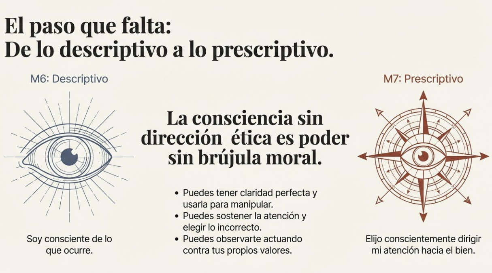
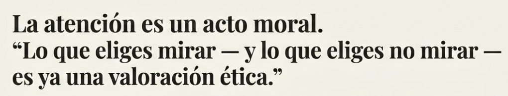
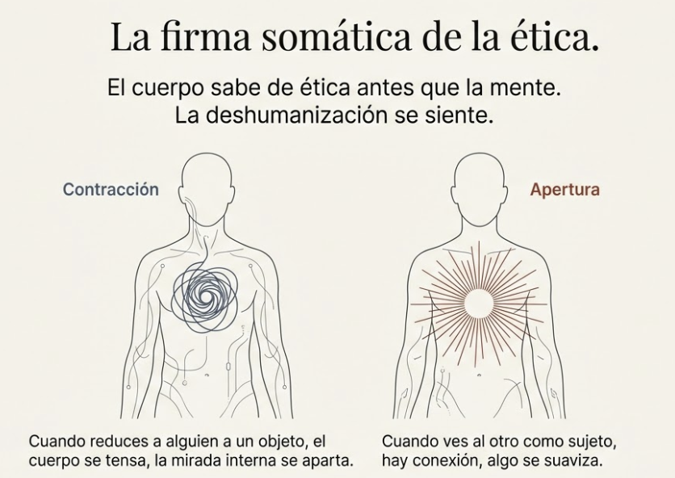
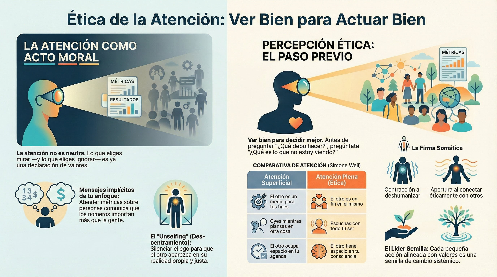

# Apertura: La consciencia se vuelve ética

## Ver bien para actuar bien

**Pregunta que abre este módulo:** ¿Hacia dónde _debería_ dirigir mi consciencia — y qué consecuencias tiene lo que elijo mirar y lo que elijo ignorar?

---

## El paso que falta

#grafica  Brújula con aguja roja: "La Consciencia se Vuelve Ética — ¿Hacia dónde debería dirigir mi consciencia?"

En M6 trabajaste una pregunta poderosa: ¿hacia dónde dirijo mi consciencia?

Aprendiste a clarificar tu intención antes de decidir. A ampliar tu campo para ver lo que tus filtros ocultan. A sostener la consciencia en el momento sin ser arrastrado. A transitar el después con honestidad y sin destruirte.

Ahora sabes observar tu proceso mientras decides. Esa es la transformación de M6: "Puedo observar dónde está mi atención mientras decido."

Pero hay una pregunta que M6 dejó abierta: **¿Y si lo que quiero no es lo que está bien?**

Puedes tener claridad perfecta sobre lo que quieres. Campo ampliado. Capacidad de sostener el proceso. Autocompasión para aprender. Y usar todo eso para fines que no están alineados con lo que realmente importa.

La consciencia sin dirección ética es poder sin brújula moral. Puedes ver muy bien y usar esa visión para manipular. Puedes decidir con lucidez y elegir lo incorrecto. Puedes observarte mientras actúas y actuar contra tus propios valores.

M7 completa el arco: la consciencia que empezó siendo descriptiva — "soy consciente de X" — se vuelve prescriptiva — "elijo conscientemente dirigir mi atención hacia Y porque es lo correcto".

#ppt  El paso que falta: M6 descriptivo (ojo) → M7 prescriptivo (brújula), poder sin brújula moral

---

## Lo que traes de los módulos anteriores

#grafica  Torre de bloques M1→M7: no llegas vacío, integración de capacidades del programa

No llegas aquí vacío. Has construido capacidades que ahora se ponen al servicio de algo mayor:

**De M1** traes humildad epistemológica: sabes que tu mente construye la realidad más de lo que la percibe. Esa humildad es la base de la ética — quien cree que siempre ve bien, no puede cuestionarse.

**De M2** traes el cuerpo como fuente de información. Vas a descubrir que el cuerpo también sabe de ética: hay una firma somática cuando actúas contra tus valores, y otra cuando estás alineado.

**De M3** traes el espacio entre estímulo y respuesta. Ese espacio es donde la ética se juega: sin pausa, no hay elección moral, solo reacción.

**De M4** traes el autocuidado como base. Vas a ver que sin sostenibilidad personal, la ética se erosiona — el agotamiento es enemigo de la integridad.

**De M5** traes la extensión hacia el otro: del yo al nosotros. La ética es fundamentalmente relacional — se trata de cómo tratamos a otros.

**De M6** traes la meta-consciencia: observar tu proceso mientras decides. Esa capacidad es la herramienta central para detectar cuándo te desvías de tus valores.

Todo esto se integra ahora en una pregunta: **¿Cómo traduzco mi consciencia en acción alineada con lo que está bien?**

---

## La pregunta central de M7

> ¿Cómo dirijo mi consciencia hacia el bien y actúo en coherencia con mis valores — incluso cuando es difícil, incluso cuando nadie mira, incluso cuando el sistema empuja en otra dirección?

Esta pregunta tiene varias capas:

**Dirigir hacia el bien:** No basta con ser consciente; hay que elegir hacia dónde apuntar esa consciencia. Y esa elección es ya un acto moral.

**Actuar en coherencia:** El conocimiento ético que no se traduce en acción es irrelevante. La ética del líder se mide en lo que hace, no en lo que sabe.

**Incluso cuando es difícil:** La ética fácil no es ética; es conveniencia. El territorio real de la moral es cuando hay tensión, coste, presión.

**Incluso cuando nadie mira:** La integridad es lo que haces cuando no hay testigos. El líder consciente no actúa bien para parecer bueno; actúa bien porque es quien es.

**Incluso cuando el sistema empuja:** Las organizaciones tienen fuerzas que presionan hacia lo incorrecto. El líder ético las ve y elige conscientemente cómo responder.

---

## La atención como acto moral

#ppt  "La atención es un acto moral. Lo que eliges mirar — y lo que eliges no mirar — es ya una valoración ética."

Aquí está la tesis central de este módulo:

**Lo que eliges mirar — y lo que eliges no mirar — es ya un acto moral.**

No puedes actuar bien hacia alguien que no ves. No puedes cuidar lo que ignoras. No puedes hacer justicia a quien es invisible para ti.

La atención no es neutra. Es valoración implícita.

|Lo que atiendes|Mensaje implícito|
|---|---|
|Métricas, no personas|Los números importan más que la gente|
|Urgente, no importante|El ruido importa más que la dirección|
|Algunos stakeholders, no todos|Algunos no cuentan|
|Lo que confirma, no lo que cuestiona|No quiero ver la realidad completa|

Ignorar sistemáticamente a ciertas personas, datos o perspectivas no es descuido. Es una declaración de irrelevancia. Y esa declaración tiene consecuencias éticas.

---

## "Unselfing": salir del centro para ver al otro

#ppt  El obstáculo: EGO como filtro (flechas centrípetas) vs UNSELFING (luz hacia Realidad del Otro) — Murdoch

La filósofa Iris Murdoch[^1] identificó el obstáculo principal para ver bien: **el ego**.

No el ego como vanidad obvia, sino como sesgo atencional. El egocentrismo hace que todo gire alrededor de "mí":

- ¿Cómo me afecta esto a mí?
- ¿Qué piensan de mí?
- ¿Cómo quedo yo?

Cuando operas desde ese centro, el otro no aparece tal como es. Aparece filtrado por lo que significa para ti. No lo ves; ves tu relación con él. No lo escuchas; escuchas lo que quieres oír.

Murdoch propone algo que llama **"unselfing"**: vaciarse del yo para que el otro pueda aparecer en su realidad propia.

> "He usado la palabra 'atención', que tomo de Simone Weil, para expresar la idea de una mirada justa y amorosa dirigida hacia una realidad individual."[^1]

Una mirada **justa**: que ve lo que es, no lo que me conviene. Una mirada **amorosa**: que quiere el bien del otro, no solo el mío. Dirigida hacia una **realidad individual**: que ve a esta persona concreta, no una categoría.

Esto conecta directamente con M5: la relación Yo-Tú versus Yo-Ello. Ver al otro como sujeto requiere esta atención ética. Verlo como objeto es resultado de atención reducida o egocéntrica.

---

## "La atención es la forma más rara de generosidad"

#ppt  "La atención como la forma más rara de generosidad" — Atención Superficial vs Atención Plena (Ética) — Weil

Simone Weil[^2] fue más lejos: propuso que la atención plena al otro es la forma más pura de amor.

No es lo que haces por el otro. Es cómo lo miras.

|Atención superficial|Atención plena|
|---|---|
|Oyes mientras piensas en otra cosa|Escuchas con todo tu ser|
|Ves lo que esperas ver|Ves lo que está ahí|
|El otro es medio para tus fines|El otro es fin en sí mismo|
|El otro ocupa espacio en tu agenda|El otro tiene espacio en tu consciencia|

La atención crea espacio para que el otro exista plenamente. Sin atención, el otro es reducido a lo que necesitas de él — su función, su utilidad, su rol.

Piensa en la diferencia entre un colaborador que sientes que te ve de verdad, y uno para quien eres intercambiable. La diferencia no está en lo que hacen por ti; está en la calidad de su atención.

**Esa misma diferencia la produces tú hacia los demás.**

---

## La firma somática de la atención ética

#ppt  La firma somática de la ética: Contracción (deshumanizar) vs Apertura (ver al otro como sujeto)

El cuerpo sabe de ética antes que la mente.

Cuando ignoras a alguien que deberías ver, hay una señal. Puede ser sutil — una leve tensión, una incomodidad que prefieres no mirar, un apartar la mirada interno. Pero está ahí.

Cuando reduces a alguien a objeto — cuando lo ves como "el problemático", "el recurso", "el obstáculo" — hay algo en el cuerpo que se contrae. La deshumanización tiene firma somática.

Y cuando ves de verdad — cuando el otro aparece como sujeto, cuando le das atención plena — hay otra sensación. Apertura. Conexión. Algo que se suaviza.

La práctica de M2 — escuchar al cuerpo — se aplica aquí: el cuerpo te avisa cuando tu atención se ha vuelto éticamente problemática. La pregunta es si estás dispuesto a escucharlo.

**Pregunta para notar:** Piensa en alguien a quien has estado ignorando o reduciendo. ¿Qué sientes en el cuerpo cuando traes a esa persona a tu consciencia?

---

## Antes de preguntar "qué hacer", pregunta "estoy viendo bien"

La mayoría de la formación ética en liderazgo empieza en la acción: ¿qué es lo correcto? ¿qué debo hacer? ¿cómo resuelvo este dilema?

Pero la acción ética tiene un paso previo: **la percepción ética**.

|Pregunta habitual|Pregunta previa|
|---|---|
|¿Qué decisión tomo?|¿Qué no estoy viendo?|
|¿Cómo resuelvo esto?|¿A quién no estoy escuchando?|
|¿Cuál es la mejor opción?|¿Qué perspectiva me falta?|
|¿Qué es lo correcto?|¿Estoy viendo la situación completa?|

La acción ética comienza en la percepción, no en la decisión.

Si no ves al stakeholder afectado, no puedes actuar éticamente hacia él. Si no ves la dimensión humana del problema, tomarás decisiones "técnicas" que dañan personas. Si no ves tus propios puntos ciegos, actuarás desde ellos creyendo que actúas bien.

**Ver bien es el primer acto del liderazgo ético.**

---

## Conexión con M6: de ampliar el campo a ampliarlo éticamente

En M6 trabajaste ampliar el campo de visión. Identificaste cuatro filtros que limitan lo que ves:

- Lo que tu **posición** te impide ver
- Lo que tu **historia** te lleva a filtrar
- Lo que la **interdependencia** hace invisible
- Lo que el **entorno** estrecha adicionalmente

Ahora esos mismos filtros tienen dimensión ética:

**Posición:** Las voces que tu poder silencia no solo son información que te falta — son personas que no estás viendo. El filtro de posición tiene consecuencias morales.

**Historia:** Los sesgos que distorsionan tu percepción no solo afectan la calidad de tus decisiones — pueden hacerte tratar injustamente a personas que no encajan en tus categorías.

**Interdependencia:** Las conexiones que no ves no son solo complejidad del sistema — son personas afectadas por tus decisiones que no estás considerando.

**Entorno:** La presión que estrecha tu campo no solo reduce tu efectividad — puede hacerte ignorar lo que éticamente no deberías ignorar.

Ampliar el campo no es solo estrategia para decidir mejor. Es responsabilidad ética para ver a quienes deberías ver.

---

## La transformación de M7

#grafica  Progresión M1-M4 Regulación → M5-M6 Observación → M7 Intención Ética — círculos concéntricos

Al completar este módulo, la transformación esperada es:

> **"Cada pequeña acción consciente, alineada con mis valores y propósito, es una semilla de cambio."**

No es una transformación grandiosa. No vas a cambiar el mundo entero. Pero vas a poder actuar con intención clara, alineado con lo que importa, incluso cuando es difícil. Y cada una de esas acciones tiene efecto.

La metáfora del **líder semilla** que ha acompañado el programa se completa aquí: la semilla no transforma la tierra de golpe, pero cada semilla plantada con consciencia puede crecer y dar fruto.

---

## Lo que exploraremos en M7

Este módulo tiene cuatro temas más después de esta introducción:

**Tema 1: El territorio de la acción ética** Qué significa ser ético más allá de cumplir normas. La virtud como hábito, la prudencia como discernimiento. Y por qué personas buenas fallan éticamente sin darse cuenta — los puntos ciegos éticos.

**Tema 2: Propósito y alineamiento** El propósito como brújula cuando todo es ambiguo. Y el modelo para traducir propósito en acción: Propósito → Objetivos → Intención.

**Tema 3: La acción consciente y ética** La integración del proceso ANTES-DURANTE-DESPUÉS de M6 con la dimensión ética. Cómo mantener la alineación con tus valores en el flujo de la acción real.

**Tema 4: El líder semilla — cierre del programa** Integración de todo el viaje. La práctica de Metta como cierre. Y la visión de futuro: el programa termina, la práctica continúa.

---

## La práctica de M7: Metta (amor benevolente)

La práctica que acompaña este módulo es **Metta**: cultivar intencionalmente una actitud de benevolencia y dirigirla deliberadamente hacia círculos cada vez más amplios.

|Práctica anterior|Tipo|Lo que entrena|
|---|---|---|
|M1: Atención focalizada|Focused Attention|Concentración sostenida|
|M2: Body Scan|FA extendida|Consciencia corporal|
|M3: Observar pensamientos|Transición FA→OM|Ver eventos mentales|
|M4: Pausa de 3 minutos|Regulación|Interrupción de cadenas|
|M5: Compasión|Generativa|Extensión hacia el otro|
|M6: Open Monitoring|OM puro|Observar el proceso|
|**M7: Metta**|**Generativa dirigida**|**Intención ética activa**|

Metta entrena exactamente lo que M7 requiere: generar intención clara y dirigirla con propósito hacia el bien. No esperas a que surja la bondad; la cultivas. No esperas a que la claridad aparezca; la generas.

El Tema 4 desarrollará la práctica en detalle.

---

## La característica del líder semilla

Cada módulo cultiva una característica. La de M7 es:

> **Acción ética:** Traduce consciencia en acción alineada con valores.

El líder que solo ve no transforma. El líder que actúa sin ver daña. El líder consciente ve bien para actuar bien — y cada acción es una semilla de cambio.

---

## Comenzamos

Has desarrollado la capacidad de observar. Ahora aprenderás a dirigir esa observación hacia el bien.

La atención no es solo cognitiva; es moral. Lo que eliges mirar determina lo que puedes hacer. Y lo que puedes hacer determina quién eres como líder.

Ver bien es el primer acto. Actuar bien es su consecuencia natural.

Bienvenido al cierre del programa.

---

## Referencias incluidas

[^1]: Murdoch, I. (1970). _The Sovereignty of Good._ Routledge.

[^2]: Weil, S. (1947). _Gravity and Grace._ Routledge.

---
## Material adicional del tema #aux
### Infografías del tema 

#infografia  Ética de la Atención: atención como acto moral, percepción ética, unselfing, firma somática, líder semilla