# Tema 3: La acción consciente y ética

#imagen 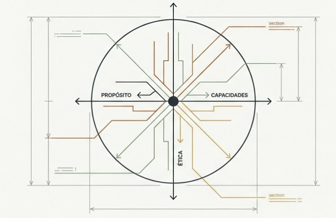 Blueprint técnico con ejes Propósito, Capacidades, Ética: portada del modelo integrador

- [Por que este tema es necesario](#por-que-este-tema-es-necesario)
		- [Integrar todo lo aprendido en accion real con orientacion etica](#integrar-todo-lo-aprendido-en-accion-real-con-orientacion-etica)
- [1. El momento de integrar](#1-el-momento-de-integrar)
- [2. El modelo integrador: una visión de conjunto](#2-el-modelo-integrador-una-visión-de-conjunto)
	- [2.1 El eje de alineamiento (de T2)](#21-el-eje-de-alineamiento-de-t2)
	- [2.2 El ciclo temporal (de M6)](#22-el-ciclo-temporal-de-m6)
	- [2.3 El núcleo: la atención](#23-el-núcleo-la-atención)
	- [2.3 El contexto: donde todo se pone a prueba](#23-el-contexto-donde-todo-se-pone-a-prueba)
	- [2.4 Las capacidades: un repertorio circular](#24-las-capacidades-un-repertorio-circular)
- [3. La capa ética: lo que M7 añade al proceso](#3-la-capa-ética-lo-que-m7-añade-al-proceso)
- [4. Las capacidades M1-M5 en acción ética](#4-las-capacidades-m1-m5-en-acción-ética)
- [5. Cuando el contexto cambia: actualizar la atención](#5-cuando-el-contexto-cambia-actualizar-la-atención)
- [Dimensión experiencial #insight](#insight)
- [Referencias](#referencias)
- [Material adicional del tema #aux](#aux)
	- [Infografías del tema](#infografías-del-tema)


----

## Por que este tema es necesario

#### Integrar todo lo aprendido en accion real con orientacion etica

**Pregunta que responde:**
Como integro todo lo que he aprendido — proposito, capacidades, proceso — en la accion real, momento a momento, con orientacion etica?

Este tema es la sintesis practica del programa completo. No anade contenido nuevo — integra todo lo anterior en un modelo operativo para la accion consciente y etica.

Las capacidades de M1-M5, el proceso de M6, y la orientacion etica de M7 se unen aqui en una estructura que puedes usar en la vida real.

---

## 1. El momento de integrar

#grafica 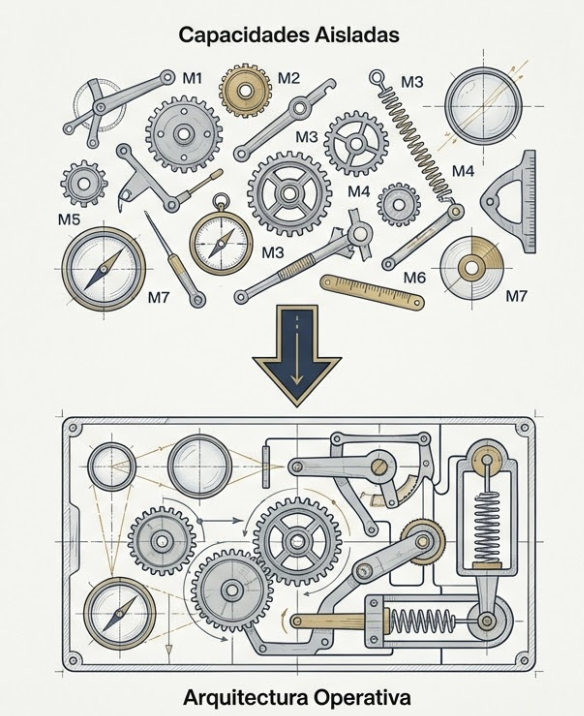 Opción 1: "Capacidades Aisladas → Arquitectura Operativa" — engranajes sueltos M1-M7 → máquina integrada
#ppt  Opción 2: "Cómo integrar lo aprendido en el flujo real" — puente Golden Gate: M1-M6 → Vida Real

#ppt 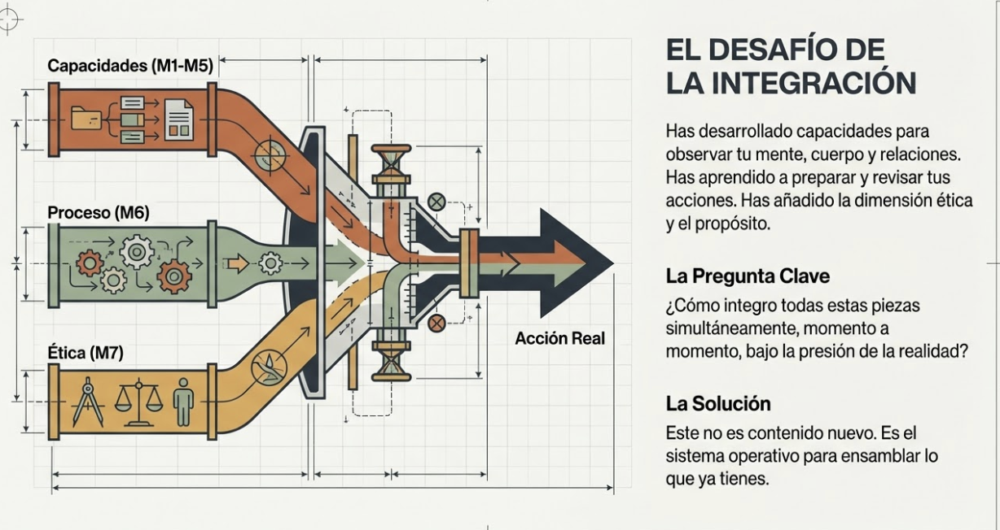 Opción 3: "El Desafío de la Integración" — tuberías: Capacidades + Proceso + Ética → Acción Real
Has recorrido un camino largo.

En M1-M5 desarrollaste capacidades: entender tu arquitectura mental, escuchar tu cuerpo, crear espacio entre estímulo y respuesta, regularte, conectar con otros.

En M6 aprendiste a observar tu proceso de decisión: preparar antes, sostener durante, transitar después.

En M7 has añadido la dimensión ética: la atención como acto moral (Apertura), la virtud y los puntos ciegos (T1), el propósito como brújula y el modelo de alineamiento (T2).

Ahora viene la pregunta práctica: **¿Cómo uso todo esto junto, en el flujo de la vida real?**

Este tema presenta un modelo integrador que conecta todas las piezas. No como teoría, sino como estructura operativa para la acción consciente y ética.

---

## 2. El modelo integrador: una visión de conjunto

El modelo tiene varios componentes que operan simultáneamente:

#grafica  Opción 1: Modelo integrador completo — círculo ATENCIÓN central, M1-M6, ejes alineamiento y temporal

#grafica  Opción 2: "Entrenamiento Mindfulness" — versión polished: ATENCIÓN central, M1-M7, Propósito→Objetivos→Intención, Antes/Durante/Después


#grafica 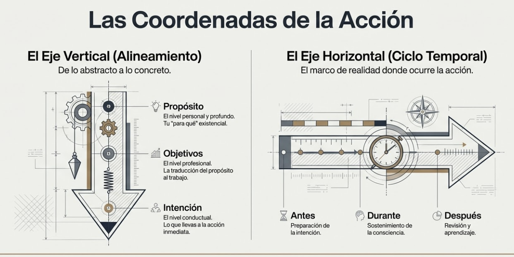 Opción 3: "Las Coordenadas de la Acción" — dos ejes separados: Vertical (Alineamiento) + Horizontal (Ciclo Temporal)
### 2.1 El eje de alineamiento (de T2)

#ppt  Opción 1: "CAPA 2: El Eje de Alineamiento" — esquemático: Propósito(Ser)→Objetivos(Hacer)→Intención(Actuar)

#ppt 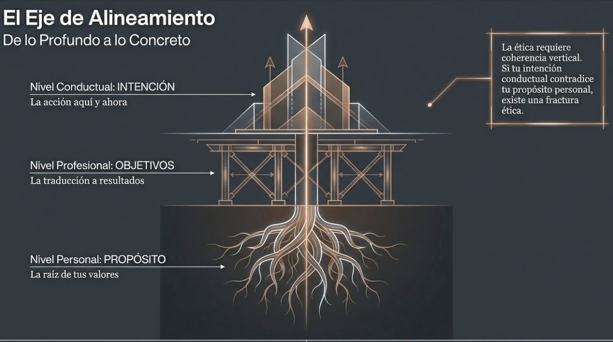 Opción 2: "El Eje de Alineamiento: De lo Profundo a lo Concreto" — árbol con raíces (Propósito) → puente (Objetivos) → flechas (Intención)

```
PROPÓSITO → OBJETIVOS → INTENCIÓN
(Personal)   (Profesional)  (Conductual)
```

Este eje va de lo profundo a lo concreto:

- El **propósito** vive en el nivel personal — es tu "para qué" profundo
- Los **objetivos** operan en el nivel profesional — traducen el propósito al trabajo
- La **intención** se activa en el nivel conductual — es lo que llevas a cada acción específica

### 2.2 El ciclo temporal (de M6)

#ppt 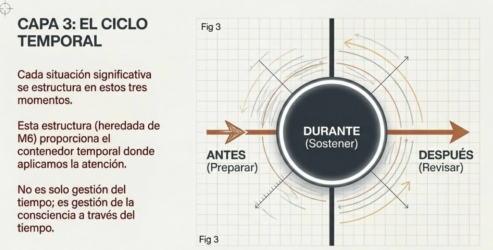 "CAPA 3: El Ciclo Temporal" — ANTES (Preparar) → DURANTE (Sostener) → DESPUÉS (Revisar)

```
ANTES → DURANTE → DESPUÉS
```

Cada situación significativa tiene estos tres momentos:

- **ANTES:** Preparar la intención
- **DURANTE:** Sostener la consciencia
- **DESPUÉS:** Revisar y aprender

### 2.3 El núcleo: la atención

#ppt 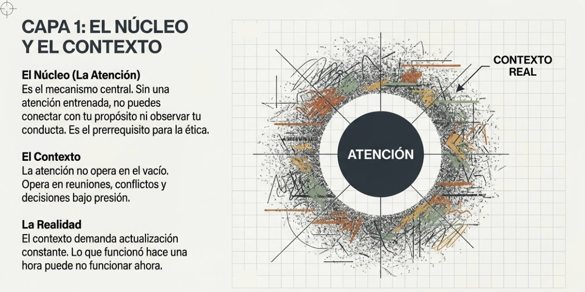 "CAPA 1: El Núcleo y el Contexto" — ATENCIÓN central + CONTEXTO REAL exterior

En el centro de todo está la **atención**. Es el mecanismo que hace posible tanto el alineamiento como el ciclo temporal.

Sin atención entrenada:

- No puedes conectar con tu propósito
- No puedes sostener la intención durante la acción
- No puedes observar tu proceso para aprender

La atención es lo que has entrenado con mindfulness a lo largo del programa. Aquí se pone al servicio de la acción ética.

### 2.3 El contexto: donde todo se pone a prueba

La atención no opera en el vacío. Opera en **contextos reales**: reuniones, conversaciones difíciles, decisiones bajo presión, emails que escribes, planificaciones que haces.

El contexto demanda actualización constante. Lo que funcionó en una reunión puede no funcionar en la siguiente. La atención debe recalibrarse continuamente según lo que el momento requiere.

### 2.4 Las capacidades: un repertorio circular

#grafica 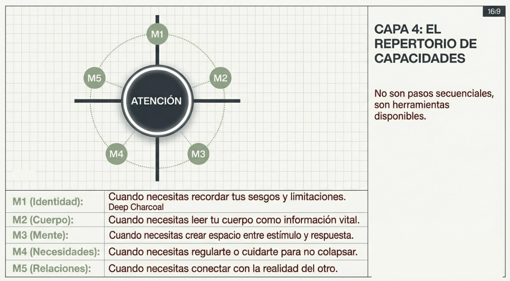 "CAPA 4: El Repertorio de Capacidades" — M1-M5 circular alrededor de ATENCIÓN, herramientas disponibles

Las capacidades de M1-M5 no son pasos secuenciales. Son un **repertorio disponible** que se activa según lo que el momento necesita:

|Capacidad|Módulo|Cuándo la necesitas|
|---|---|---|
|Consciencia de lo que soy|M1|Cuando necesitas recordar tus sesgos y limitaciones|
|Consciencia de cómo estoy|M2|Cuando necesitas leer tu cuerpo como información|
|Consciencia de lo que pienso-siento|M3|Cuando necesitas crear espacio antes de reaccionar|
|Consciencia de lo que necesito|M4|Cuando necesitas regularte o cuidarte|
|Consciencia de lo que necesitamos|M5|Cuando necesitas conectar con el otro|

**Todas pueden activarse en cualquier fase del proceso.** Puedes necesitar consciencia corporal (M2) tanto antes de una reunión como durante o después. Puedes necesitar consciencia del otro (M5) en cualquier momento.

No hay un orden fijo. El contexto determina qué capacidad necesitas activar.

M6 y M7 no son capacidades más que añadir a la lista. Son el **marco contenedor**:

- **M6** aporta la estructura temporal: ANTES-DURANTE-DESPUÉS
- **M7** aporta la orientación ética: el propósito que dirige y la pregunta "¿es correcto?"

---

## 3. La capa ética: lo que M7 añade al proceso

#ppt  Opción 1: "CAPA 5: La Mejora Ética (M7)" — capa ética atraviesa todo el ciclo, busca puntos ciegos y coherencia

#grafica 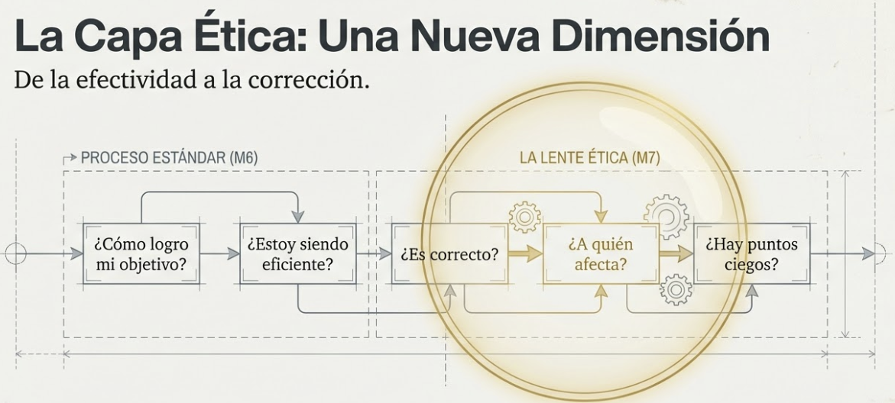 Opción 2: "La Capa Ética: Una Nueva Dimensión" — Proceso Estándar M6 → Lente Ética M7: ¿Es correcto? ¿A quién afecta? ¿Hay puntos ciegos?

El modelo de M6 era potente pero incompleto. Te permitía observar tu proceso de decisión, pero no te preguntaba si lo que decidías era correcto.

M7 añade una capa que atraviesa todo el proceso: **la orientación ética**.

En cada fase del ciclo, además de las preguntas de M6, ahora hay preguntas de M7:

- **ANTES: Preparar la intención ética**

Preguntas de M6:

- ¿Qué quiero conseguir en esta situación?
- ¿Desde dónde quiero actuar?
- ¿Qué no estoy viendo que debería ver?

Preguntas que M7 añade:

- ¿Es correcto lo que voy a hacer? ¿Está alineado con mi propósito y valores?
- ¿A quién podría afectar esta acción que no estoy considerando?
- ¿Hay algún punto ciego ético operando? ¿Estoy enmarcando esto como "decisión de negocio" para evitar ver la dimensión humana?
- ¿Mi intención sirve solo a mis intereses o también al bien de otros?

- **DURANTE: Sostener la consciencia ética**

Preguntas de M6:

- ¿Dónde está mi atención ahora mismo?
- ¿Estoy actuando desde mi intención o me han capturado?
- ¿Qué siento en el cuerpo? ¿Qué emoción está operando?

Preguntas que M7 añade:

- ¿Sigo actuando desde mis valores o me he desviado?
- ¿Estoy tratando a esta persona como sujeto (Yo-Tú) o la he reducido a objeto (Yo-Ello)?
- ¿El ethical fading está operando? ¿He perdido de vista la dimensión humana de lo que está pasando?
- Si alguien que respeto estuviera observando, ¿me sentiría bien con lo que estoy haciendo?

- **DESPUÉS: Revisar la coherencia ética**

Preguntas de M6:

- ¿Actué desde mi intención o me desvié?
- ¿Qué me capturó? ¿En qué momento?
- ¿Qué aprendí para la próxima vez?

Preguntas que M7 añade:

- ¿Hubo coherencia entre mi propósito, mis valores y mi acción?
- ¿Hubo algún punto ciego ético que ahora puedo ver?
- ¿Hay algo que reparar? ¿Alguien a quien deba algo — una disculpa, una aclaración, una conversación pendiente?
- ¿Esta acción me acercó o me alejó de la persona que quiero ser?

---

## 4. Las capacidades M1-M5 en acción ética

#ppt  Opción 1: "Las Capacidades como Brújula Ética" — tabla compacta M1-M5 con aplicación ética

#grafica 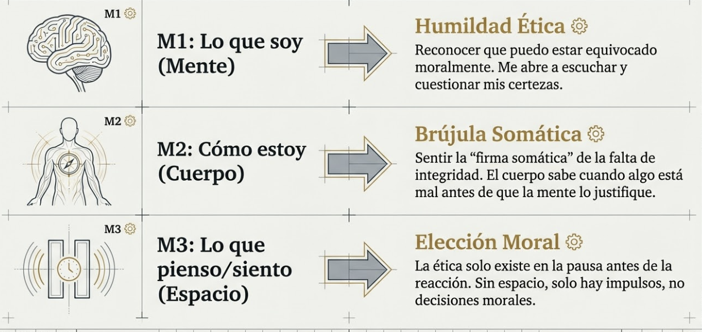 Opción 2: Tabla visual M1-M3: Humildad Ética, Brújula Somática, Elección Moral (con iconos)
#grafica  Opción 3: Tabla visual M4-M5: Sostenibilidad Ética, Ética Relacional (continuación de v2)
Cada capacidad desarrollada tiene aplicación ética específica:

- **M1 — Consciencia de lo que soy: Humildad ética**

Lo que aprendiste: Tu mente construye la realidad, opera con sesgos, no es tan racional como crees.

**Aplicación ética:** La humildad epistemológica es base de la humildad ética. Si sé que puedo estar equivocado sobre los hechos, también puedo estar equivocado sobre lo que es correcto. Esta humildad me hace más abierto a escuchar, a cuestionar mis certezas morales, a considerar que el otro puede tener razón.

**Pregunta práctica:** "¿Estoy tan seguro de tener razón que he dejado de escuchar?"

- **M2 — Consciencia de cómo estoy: El cuerpo como brújula ética**

Lo que aprendiste: El cuerpo es fuente de información, registra lo que la mente no procesa.

**Aplicación ética:** El cuerpo sabe de ética antes que la mente racionalice. Esa tensión cuando firmas algo que "técnicamente está bien" pero no lo está. Esa incomodidad que apartas cuando ignoras a alguien. La firma somática de actuar contra tus valores.

**Pregunta práctica:** "¿Qué me está diciendo el cuerpo sobre lo que estoy a punto de hacer (o acabo de hacer)?"

- **M3 — Consciencia de lo que pienso-siento: El espacio de la elección moral**

Lo que aprendiste: Puedes crear espacio entre estímulo y respuesta. Puedes observar pensamientos y emociones sin ser arrastrado.

**Aplicación ética:** La ética se juega en ese espacio. Sin pausa, no hay elección moral — solo reacción. El impulso de mentir, de atacar, de evitar, de manipular... todos pasan por ese espacio donde puedes elegir no seguirlos.

**Pregunta práctica:** "¿Estoy reaccionando automáticamente o estoy eligiendo conscientemente?"

- **M4 — Consciencia de lo que necesito: Sostenibilidad ética**

Lo que aprendiste: El autocuidado no es lujo, es necesidad. Sin regulación, colapso.

**Aplicación ética:** El agotamiento es enemigo de la integridad. Cuando estás exhausto, tus defensas éticas bajan. Tomas atajos que no tomarías descansado. La ética sostenible requiere cuidado de ti mismo.

**Pregunta práctica:** "¿Estoy en condiciones de decidir bien, o necesito regular antes de actuar?"

- **M5 — Consciencia de lo que necesitamos: La ética es relacional**

Lo que aprendiste: Del yo al nosotros. Empatía, compasión sabia, escucha profunda.

**Aplicación ética:** La ética no es abstracta — se trata de cómo tratamos a otros. La consciencia del otro es consciencia ética. Ver al otro como Tú (sujeto) en lugar de Ello (objeto) es ya un acto moral.

**Pregunta práctica:** "¿Estoy considerando genuinamente el impacto en el otro, o solo en mí?"

==**El proceso completo: un ejemplo== #practica

Imagina una situación concreta: tienes que dar feedback difícil a un colaborador sobre su desempeño. La conversación es en una hora.

**ANTES (30 minutos antes)

**Alineamiento:**

- _Propósito:_ "Mi propósito como líder es desarrollar personas para que alcancen su potencial."
- _Objetivo:_ "Que esta persona entienda qué necesita mejorar y se sienta capaz de hacerlo."
- _Intención:_ "Entrar con claridad y con cuidado. Decir la verdad con respeto. Escuchar su perspectiva."

**Capacidades que activo:**

- M1: "¿Hay algún sesgo operando? ¿Estoy siendo justo o hay algo personal que me sesga?"
- M2: "¿Cómo estoy físicamente? ¿Tenso? ¿Necesito regular antes de entrar?"
- M3: "¿Qué emociones tengo sobre esta conversación? ¿Miedo al conflicto? ¿Frustración acumulada?"

**Capa ética de M7:**

- "¿Es correcto lo que voy a decir? ¿Es verdad? ¿Es necesario? ¿Es útil para esta persona?"
- "¿Hay algo que prefiero no ver sobre mi responsabilidad en la situación?"
- "¿Estoy a punto de tratarle como problema a resolver (Ello) o como persona que merece respeto (Tú)?"

**DURANTE (en la conversación)

**Atención como núcleo:**

- Mantener el hilo de atención en el momento, en la persona, en lo que está pasando.

**Capacidades que activo según necesidad:**

- M2: "Noto tensión en el pecho. Algo no está bien. ¿Qué es?"
- M3: "Siento impulso de justificarme. Lo noto. No lo sigo."
- M5: "¿Le estoy escuchando de verdad o solo esperando mi turno para hablar?"

**Capa ética de M7:**

- "¿Sigo en mi intención o me he desviado hacia el ataque?"
- "¿Le estoy tratando con la dignidad que merece?"
- "¿El ethical fading está operando? ¿He convertido esto en 'gestión del desempeño' olvidando que hay una persona delante?"

**Cuando noto que me han capturado:**

1. Reconozco: "Me he enganchado con su defensividad"
2. Paro si puedo: "Voy a tomar un momento"
3. Vuelvo al cuerpo: respiración, pies en el suelo
4. Retomo desde la intención: "Mi propósito es ayudarle a crecer"

**DESPUÉS (tras la conversación)

**Cuidarme antes de revisar:**

- ¿Cómo estoy? ¿Necesito un momento antes de evaluar?

**Revisión del proceso:**

- "¿Actué desde mi intención o me desvié? ¿En qué momento?"
- "¿Qué me capturó? Su tono defensivo. Lo noté pero pude volver."
- "¿Qué funcionó? Escuchar primero. Preguntar antes de afirmar."

**Capa ética de M7:**

- "¿Hubo coherencia entre mi propósito (desarrollar personas) y lo que hice?"
- "¿Le traté con respeto a lo largo de toda la conversación?"
- "¿Hay algo que reparar? Quizás fui demasiado directo en un momento. Mañana le pregunto cómo está."
- "¿Esta conversación me acercó o me alejó de la persona que quiero ser como líder?"

**La práctica: no perfección, sino dirección

Este proceso puede parecer abrumador. Demasiadas preguntas. Demasiadas capas.

Pero no se trata de hacerlo perfecto. Se trata de tener una **dirección**.

Al principio, quizás solo recuerdas una pregunta antes de una reunión difícil. Con práctica, el proceso se va internalizando. Las preguntas dejan de ser lista que consultas y se convierten en forma de estar.

**La progresión natural:**

#grafica  "La Curva de Aprendizaje" — Mecánica → Intermedia → Integrada (Maestría): de lista de verificación a virtud encarnada

|Fase|Experiencia|
|---|---|
|Inicial|Consultas las preguntas conscientemente, se siente mecánico|
|Intermedia|Recuerdas algunas preguntas clave en momentos importantes|
|Avanzada|Las preguntas surgen naturalmente cuando las necesitas|
|Integrada|Ya no son preguntas — es tu forma de estar en la acción|

El objetivo no es depender del modelo. Es que la consciencia que representa se vuelva hábito. Como la virtud de T1: no lo que haces puntualmente, sino quien eres.

---

## 5. Cuando el contexto cambia: actualizar la atención

#imagen 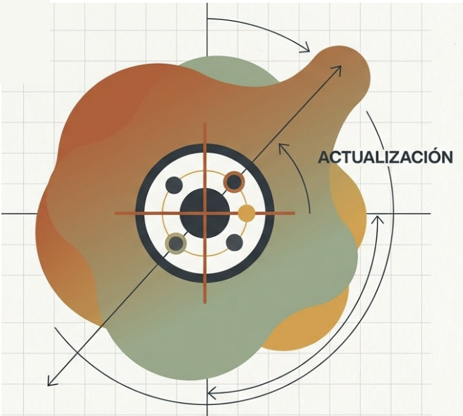 Opción 1: Modelo con formas orgánicas fluidas y "ACTUALIZACIÓN" — el contexto cambia, la atención se recalibra

#grafica 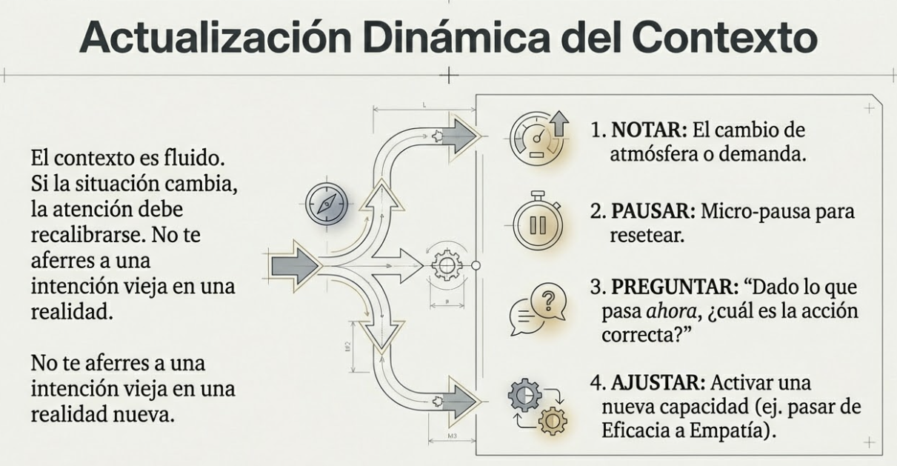 Opción 2: "Actualización Dinámica del Contexto" — 4 pasos: NOTAR → PAUSAR → PREGUNTAR → AJUSTAR

El modelo no es rígido. El contexto real es fluido, impredecible, demandante.

Una reunión que preparaste cuidadosamente puede tomar un giro inesperado. Un email que ibas a escribir rápido se convierte en una decisión importante. Una conversación casual revela algo que requiere respuesta ética.

**La atención debe actualizarse constantemente.**

Esto significa:

- No aferrarte a la intención original si el contexto ha cambiado
- Notar cuándo necesitas activar una capacidad diferente
- Reconocer cuándo estás fuera de tu zona de competencia ética y necesitas parar

**Pregunta de actualización:** "Dado lo que está pasando ahora mismo, ¿mi intención original sigue siendo la correcta? ¿Necesito ajustar?"

---

## Dimensión experiencial #insight

- Piensa en una situación difícil que tengas próximamente. ¿Cómo aplicarías el ANTES ético?
- ¿Cuál de las capacidades M1-M5 tiendes a olvidar? ¿Cuál necesitas activar más conscientemente?
- Recuerda una situación reciente donde actuaste bien éticamente. ¿Qué capacidades estaban activas? ¿Qué preguntas te hiciste (aunque fuera implícitamente)?
- ¿Dónde tiendes a fallar más: en el ANTES (no preparar la intención), en el DURANTE (perder la consciencia), o en el DESPUÉS (no revisar ni reparar)?

---


## Referencias

Este tema integra conceptos desarrollados a lo largo del programa:

- Modelo de alineamiento: adaptado de Scharmer, O. (2009). _Theory U._ y Covey, S. (1989). _The 7 Habits._
- Estructura ANTES-DURANTE-DESPUÉS: desarrollada en M6 basándose en Schön, D. (1983). _The Reflective Practitioner._
- Capacidades M1-M5: síntesis del programa completo.
- Capa ética: integración de Murdoch, I. (1970), Bazerman & Tenbrunsel (2011), y Aristóteles (_Ética a Nicómaco_).

---
## Material adicional del tema #aux
### Infografías del tema 

#infografia  Guía para la Acción Consciente y Ética: modelo circular ANTES-DURANTE-DESPUÉS, atención como núcleo, repertorio M1-M5