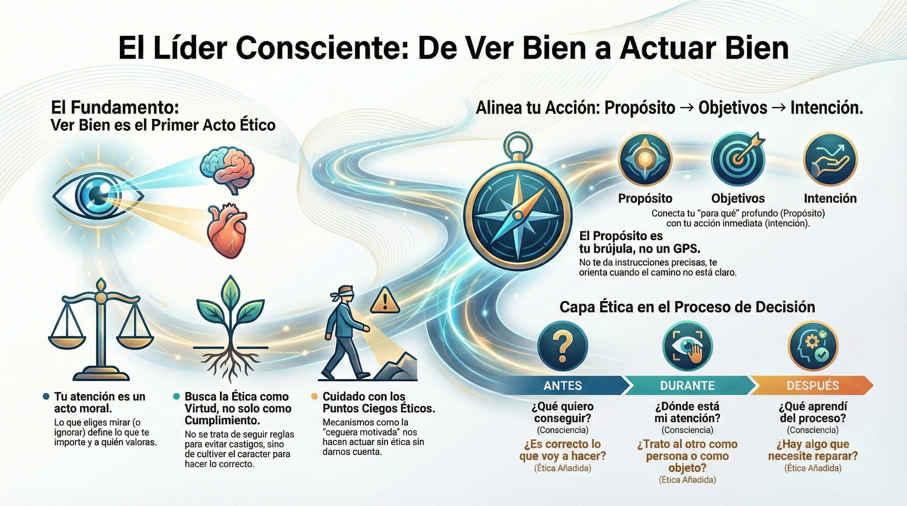

# Síntesis del Módulo 7

## Lo que hemos recorrido

M7 "Consciente de lo que está bien" ha completado el arco del programa: de consciencia descriptiva a consciencia dirigida éticamente.

### La apertura y los cuatro temas

**Apertura: La consciencia se vuelve ética** Ver bien para actuar bien. Lo que eliges mirar —y lo que eliges no mirar— tiene consecuencias morales. "Unselfing" (Murdoch) y atención como generosidad (Weil). La pregunta central: ¿hacia dónde _debería_ dirigir mi consciencia?

**Tema 1: El territorio de la acción ética** Lo que significa ser ético más allá de cumplir normas. La virtud como hábito, la prudencia como discernimiento. El ser precede al hacer. Y los puntos ciegos éticos: bounded ethicality, ethical fading, motivated blindness, slippery slope. Por qué personas buenas fallan sin saber. La meta-consciencia como antídoto.

**Tema 2: Propósito y alineamiento** El propósito como estrella polar que orienta cuando todo es ambiguo. Propósito vs. objetivos. Propósito personal y organizacional. El modelo de alineamiento: Propósito → Objetivos → Intención. Tres niveles que conectan el "para qué" profundo con el "cómo" aquí y ahora. Modelo recursivo, no lineal.

**Tema 3: La acción consciente y ética** El modelo integrador en la práctica. ANTES (preparar intención ética), DURANTE (sostener consciencia ética), DESPUÉS (revisar coherencia y reparar). Las capacidades M1-M5 como repertorio disponible. La capa ética que M7 añade al proceso de M6.

**Tema 4: El líder semilla — Cierre del programa** Integración de todo el viaje. Las siete características del líder semilla. El ser precede al hacer. Liderazgo servicial. Cada acción es una semilla. La práctica de Metta como cierre ceremonial. La práctica continúa más allá del programa.

---

## La transformación de M7

> "Cada pequeña acción consciente, alineada con mis valores y propósito, es una semilla de cambio. Puedo actuar con intención clara incluso cuando no tengo certeza, porque sé desde dónde actúo y hacia dónde miro."


---
## Sintesis de conexiones con modulos anteriores

Este tema integra todo el programa. Las conexiones explicitas:

| Modulo | Capacidad | Aplicacion etica en este tema |
|--------|-----------|------------------------------|
| M1 | Humildad epistemologica | Humildad etica: puedo estar equivocado sobre lo correcto |
| M2 | Cuerpo como informacion | El cuerpo como brujula etica: siente la incoherencia |
| M3 | Espacio entre estimulo y respuesta | El espacio de la eleccion moral |
| M4 | Autocuidado | Sostenibilidad etica: sin regulacion no hay integridad |
| M5 | Extension hacia el otro | La etica es relacional: considerar el impacto |
| M6 | ANTES-DURANTE-DESPUES | Estructura con capa etica anadida en cada fase |
| M7 T1 | Virtud y puntos ciegos | Base del discernimiento etico |
| M7 T2 | Proposito y alineamiento | Brujula que orienta la accion |

Las secciones anteriores de este tema desarrollan cada aplicacion en detalle.

---
## Hacia el cierre del programa

Has recorrido el modelo completo:

- Sabes qué significa ser ético (T1)
- Tienes una brújula de propósito (T2)
- Tienes una estructura para la acción (T3)

El Tema 4 cierra el programa. No añade contenido nuevo — integra todo el viaje y te proyecta hacia adelante.

La metáfora del líder semilla que abrió el programa encuentra ahí su cierre: cada acción consciente, alineada con tus valores, es una semilla de cambio. No necesitas transformar el mundo entero. Solo actuar con consciencia y ética en tu círculo de influencia.

Eso es suficiente. Y es mucho.

---

## Séptima característica del líder semilla: Confirmada

**Acción ética:** Dirige su consciencia hacia el bien y actúa en alineamiento con sus valores.

El líder que solo ve no transforma.
El líder que actúa sin ver daña.
El líder consciente ve bien para actuar bien, y cada acción es una semilla de cambio.

---

## El programa completo

Has recorrido un viaje de siete módulos:

```
M0: El momento que nos convoca
    |
    v
FASE 1: CONSCIENCIA DE (objetos internos)
M1: Consciente de lo que soy
M2: Consciente de cómo estoy
M3: Consciente de lo que pienso y siento
    |
    v
FASE 2: CONSCIENCIA APLICADA (regular y relacionar)
M4: Consciente de lo que necesito
M5: Consciente de lo que necesitamos
    |
    v
FASE 3: CONSCIENCIA DIRIGIDA (con intención y ética)
M6: Consciente de lo que quiero
M7: Consciente de lo que está bien
```


---

## La práctica continua

El programa termina aquí. La práctica no.

### Práctica formal

El mindfulness requiere mantenimiento. Los efectos se acumulan con práctica sostenida, pero también se erosionan sin ella.

No necesitas horas diarias. Necesitas **consistencia**:

- 10-15 minutos diarios es suficiente para mantener
- Menos es mejor que nada
- La regularidad importa más que la duración

### Práctica informal

El programa te ha dado herramientas para usar en la vida real:

- Las plantillas ANTES-DURANTE-DESPUÉS
- La escucha corporal
- La pausa de tres minutos
- Las preguntas de meta-consciencia

Úsalas. No como lista que consultas, sino como hábitos que integras.

### Reflexión periódica

De vez en cuando, detente y revisa:

- ¿Sigo conectado con mi propósito?
- ¿Dónde ha habido alineamiento? ¿Dónde desalineamiento?
- ¿Qué característica del líder semilla necesito cultivar más?

### Comunidad de práctica

No practiques solo.

La práctica sostenida es más fácil con otros. Busca personas que practican — en tu organización, fuera de ella, online. El contagio funciona en ambas direcciones: estar con otros que practican fortalece tu práctica.

Y tu práctica modela para otros. Sin decir nada, tu forma de estar invita a otros a estar de forma similar.

---

## El viaje continúa

El programa termina aquí. La práctica no.

Cada día es una nueva oportunidad de:
- Observar con humildad (M1)
- Escuchar al cuerpo (M2)
- Crear espacio (M3)
- Cuidarte (M4)
- Conectar con otros (M5)
- Observar tu proceso (M6)
- Actuar con propósito y ética (M7)

Eres una semilla. El suelo es este momento. La práctica es el agua.

Buena siembra.


---
## Material adicional del tema #aux
### Infografías del tema 

#infografia  Síntesis: de ver bien a actuar bien, alineación propósito→objetivos→intención, capa ética en proceso de decisión