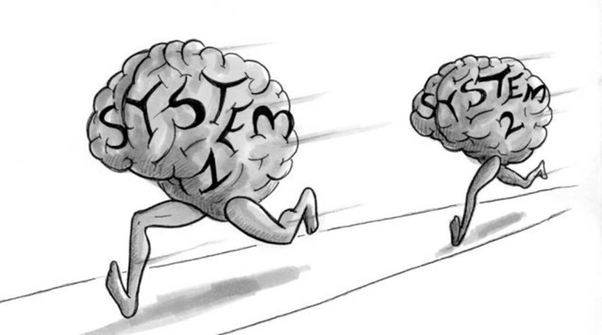
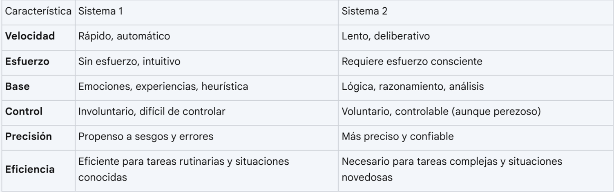

# Dos Sistemas de Pensamiento

#teoria
Existen dos modos de pensamiento:

**Sistema 1**: Opera de manera rápida y automática, con poco o ningún esfuerzo y sin sensación de control voluntario
**Sistema 2**: Centra la atención en las actividades mentales esforzadas que lo demandan. Estas operaciones están a menudo asociadas a la experiencia subjetiva de actuar, elegir y concentrarse.

Cuando pensamos en nosotros mismos nos identificamos con el sistema 2, con el yo consciente y racional, que tiene creencias, hace elecciones y decide qué pensar y que hacer. Sin embargo, **aunque el sistema 2 cree estar donde está la acción, lo que esta pasando en el momento presente, realmente el protagonista habitual de la historia es el sistema 1**…. El sistema 2 puede actuar tomando las riendas y anulando los irresponsables impulsos y asociaciones del sistema 1.

Pordemos estar ciegos para lo evidente y, además, ciegos para nuestra ceguera"

#imagen
 Portada del libro "Pensar rápido, pensar despacio" de Daniel Kahneman. Kahneman es descrito como "El psicólogo más importante de la actualidad y Premio Nobel de Economía".

#imagen
 Ilustración humorística de dos cerebros antropomorfizados corriendo. El cerebro etiquetado como "System 1" va adelantado y corre rápidamente, mientras el cerebro "System 2" va detrás, más lento. Representa metafóricamente cómo el pensamiento automático (Sistema 1) suele llegar antes que el pensamiento deliberativo (Sistema 2).

#explicacion
Los Sistemas de Pensamiento 1 y 2: Una Mirada Profunda
Los sistemas de pensamiento 1 y 2, como se describen en las fuentes, representan dos modos distintos de procesamiento mental que influyen en nuestros juicios y decisiones. El Sistema 1, también conocido como pensamiento rápido, es intuitivo, automático y emocional. Opera rápidamente y sin esfuerzo, basándose en impresiones, asociaciones y respuestas preestablecidas para navegar por el mundo. Este sistema es eficiente para manejar tareas rutinarias y responder a situaciones familiares, pero es propenso a sesgos y errores, especialmente en situaciones complejas o novedosas.
Por otro lado, el Sistema 2, o pensamiento lento, es deliberativo, lógico y analítico. Requiere esfuerzo consciente, atención focalizada y el uso de reglas y algoritmos para procesar información y llegar a conclusiones. Este sistema es más preciso y confiable que el Sistema 1, pero es más lento y consume más recursos cognitivos.
Ejemplos:
Conducir un coche por una carretera vacía es una tarea principalmente del Sistema 1. Nuestra experiencia nos permite realizar esta acción de forma casi automática, sin necesidad de un análisis consciente de cada paso.
Resolver una multiplicación compleja como 17 x 24 requiere la intervención del Sistema 2. Necesitamos concentrarnos, aplicar reglas matemáticas y realizar un esfuerzo mental deliberado para llegar a la solución.
La Interacción entre los Sistemas:
Ambos sistemas interactúan constantemente. El Sistema 1 ofrece sugerencias, impresiones e intuiciones al Sistema 2, que puede aceptarlas, modificarlas o rechazarlas. Idealmente, el Sistema 2 actúa como un "controlador" del Sistema 1, supervisando sus sugerencias y corrigiendo sus errores. Sin embargo, el Sistema 2 es "perezoso" y tiende a conservar energía, por lo que a menudo acepta las sugerencias del Sistema 1 sin un análisis exhaustivo. Esto puede llevar a decisiones precipitadas e irracionales.

#imagen
 Tabla comparativa entre Sistema 1 y Sistema 2 con las siguientes características: Velocidad, Esfuerzo, Base, Control, Precisión, Eficiencia.

#explicacion
Característica Sistema 1 Sistema 2
Velocidad: Rápido, automático / Lento, deliberativo
Esfuerzo: Sin esfuerzo, intuitivo / Requiere esfuerzo consciente
Base: Emociones, experiencias, heurística / Lógica, razonamiento, análisis
Control: Involuntario, difícil de controlar / Voluntario, controlable (aunque perezoso)
Precisión: Propenso a sesgos y errores / Más preciso y confiable
Eficiencia: Eficiente para tareas rutinarias y situaciones conocidas / Necesario para tareas complejas y situaciones novedosas

Ejemplos que ilustran las diferencias:
Percepción: El Sistema 1 nos permite percibir instantáneamente la profundidad y la distancia entre objetos, como la diferencia de altura entre dos torres. En contraste, calcular la longitud total de un conjunto de líneas requiere la intervención del Sistema 2, ya que implica un proceso de estimación, conteo y multiplicación.
Asociación: El Sistema 1 asocia ideas de manera automática, creando historias coherentes incluso con información limitada. Por ejemplo, al leer "Mindik es inteligente y fuerte...", el Sistema 1 puede llevarnos a concluir que sería una buena líder, sin considerar otros aspectos de su personalidad.
Sustitución: Cuando se enfrenta a preguntas difíciles, el Sistema 1 puede sustituirlas por preguntas más fáciles que puede responder rápidamente. Por ejemplo, en lugar de evaluar la probabilidad de que Bill sea un músico de jazz aficionado, el Sistema 1 podría evaluar cuánto se parece Bill al estereotipo de un jazzista aficionado.
Control de impulsos: El Sistema 2 es el responsable de controlar los impulsos del Sistema 1, como evitar decir algo inapropiado en un momento de ira. Sin embargo, cuando el Sistema 2 está ocupado o cansado, el Sistema 1 tiene más influencia sobre nuestro comportamiento.
Implicaciones en la Toma de Decisiones:
La interacción entre ambos sistemas es crucial en la toma de decisiones. El Sistema 1 proporciona una primera respuesta rápida, mientras que el Sistema 2 tiene la capacidad de analizar, cuestionar y modificar esta respuesta para llegar a una decisión más informada. Sin embargo, la "pereza" del Sistema 2 puede llevar a que se acepten las sugerencias del Sistema 1 sin un análisis adecuado, resultando en decisiones sesgadas e irracionales.

#imagen #ejercicio 
 Ejercicio tipo Stroop con las palabras "IZQUIERDA", "izquierda", "Derecha", "DERECHA", "derecha" dispuestas en diferentes posiciones y con diferentes formatos (mayúsculas/minúsculas). El ejercicio demuestra la interferencia cognitiva entre el Sistema 1 (leer automáticamente) y el Sistema 2 (identificar la posición).

#imagen  #ejercicio
Experimento que muestra cómo somos capaces de leer texto que no está bien escrito pero nuestro cerebro de la sentido automáticamente

#imagen #ejercicio 
Cuadrícula de 3x3 con la palabra "YOU" repetida 9 veces, pero una de ellas dice "YOO" Ejercicio de atención selectiva que demuestra cómo el Sistema 1 puede hacernos pasar por alto detalles cuando cree reconocer un patrón familiar.

#imagen #ejercicio 
 Solución aCuadrícula de 3x3 con la palabra "YOU" repetida 9 veces, pero una de ellas dice "YOO" (marcada con círculo rojo). 

#imagen #ejercicio 
 Versión ampliada del ejercicio anterior: múltiples filas con la palabra "YOU" repetida muchas veces (aproximadamente 100+ repeticiones), con un único "YOO" escondido entre ellas . Demuestra la ceguera por inatención y cómo el Sistema 1 nos hace "ver" lo que esperamos ver en lugar de lo que realmente hay.

#imagen #ejercicio 
 Solución a Versión ampliada del ejercicio anterior: múltiples filas con la palabra "YOU" repetida muchas veces (aproximadamente 100+ repeticiones), con un único "YOO" escondido entre ellas (marcado con círculo rojo). 
