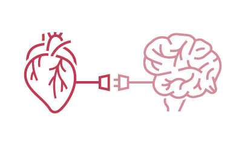

# La Interocepción: Un cambio de paradigma

#imagen
 Ilustración artística estilo grabado/vintage mostrando un corazón anatómico y un cerebro conectados por rayos eléctricos azules, representando la tensión entre cuerpo y mente en la visión dualista. Tonos sepia y azul sobre fondo beige.

#imagen
 Icono minimalista de un corazón y un cerebro unidos en un solo diseño, representando la integración cuerpo-mente de la revolución interoceptiva. Líneas simples en color turquesa/cian.

#teoria
**Visión cartesiana tradicional:**
Dualidad mente-cuerpo
- Esta visión dualista ha tenido una profunda influencia en el pensamiento occidental, incluyendo la medicina y la ciencia.
- Descartes consideraba al **cuerpo como una máquina** que funciona según principios mecánicos, mientras que la **mente era vista como una entidad inmaterial y separada**, responsable del pensamiento y la consciencia.
- La visión cartesiana dio lugar a un **enfoque cerebrocéntrico** en el estudio de la mente, donde **el cerebro se consideraba el único responsable de la experiencia**. Esta perspectiva **ignoraba la influencia del cuerpo** y las señales interoceptivas en la formación de la consciencia y las emociones

**Revolución interoceptiva:**
Reintegrando cuerpo y mente
- Se reconoce que la experiencia no se puede reducir únicamente a la actividad cerebral, sino que surge de la interacción dinámica entre el cerebro y el cuerpo.
- La percepción, las emociones, la memoria y la identidad están profundamente enraizadas en el organismo y son moldeadas por las señales interoceptivas.
- El cambio de paradigma hacia la interocepción abogan por una **"biología humanista"**, un **enfoque más holístico e integrado del ser humano** que **reconoce la interdependencia entre cuerpo y mente**.

#explicacion
La Interocepción: Un Cambio de Paradigma en la Neurociencia

La interocepción, definida como la capacidad del sistema nervioso para detectar, interpretar e integrar señales originadas en el propio organismo, representa un cambio de paradigma en la neurociencia. Este cambio desafía la visión tradicional cerebrocéntrica que ha dominado la disciplina durante siglos, reconociendo la influencia crucial del cuerpo en la formación de la experiencia, la cognición y las emociones.

El Dualismo Cartesiano: Separación de Mente y Cuerpo
René Descartes, filósofo y matemático del siglo XVII, estableció una dicotomía fundamental entre la mente (res cogitans) y el cuerpo (res extensa). Esta visión dualista ha tenido una profunda influencia en el pensamiento occidental, incluyendo la medicina y la ciencia.

Descartes consideraba al cuerpo como una máquina que funciona según principios mecánicos, mientras que la mente era vista como una entidad inmaterial y separada, responsable del pensamiento y la consciencia.

El Cerebrocentrismo: La Mente Reside Solo en la Cabeza
La visión cartesiana dio lugar a un enfoque cerebrocéntrico en el estudio de la mente, donde el cerebro se consideraba el único responsable de la experiencia. Esta perspectiva ignoraba la influencia del cuerpo y las señales interoceptivas en la formación de la consciencia y las emociones.

La Revolución Interoceptiva: Reintegrando Cuerpo y Mente
La teoría del marco subjetivo neuronal, junto con el creciente interés en la interocepción, representa un cambio radical que desafía el dualismo cartesiano y el cerebrocentrismo. Se reconoce que la experiencia no se puede reducir únicamente a la actividad cerebral, sino que surge de la interacción dinámica entre el cerebro y el cuerpo.

Hacia una Biología Humanista: Integrando la Sabiduría del Cuerpo
La teoría del marco subjetivo neuronal y el cambio de paradigma hacia la interocepción abogan por una "biología humanista", un enfoque más holístico e integrado del ser humano que reconoce la interdependencia entre cuerpo y mente. Esta perspectiva recupera la sabiduría de las tradiciones médicas antiguas que veían al cuerpo como un reflejo del estado mental y emocional.

---

#teoria
Esta revolución se ha nutrido del trabajo de numerosos investigadores y de la acumulación de evidencias científicas que demuestran la importancia de las señales del cuerpo en la percepción, las emociones, la cognición y la identidad.

1. **Tradiciones médicas antiguas** (tradicional china, la ayurvédica, la azteca o maya) que veían al cuerpo como un **reflejo del estado mental y emocional**.

2. Walter Cannon, profesor de Fisiología en la Facultad de Medicina de Harvard, publicó en 1929 un artículo crucial que introdujo el **concepto de homeostasis**. Este artículo marcó un hito en la biología y sentó las bases para la revolución interoceptiva que estamos presenciando hoy en día.

3. **Teoría del Marco Subjetivo Neuronal** (Catherine Tallon-Baudry y Antonio Damasio): **El cuerpo se convierte en el "lienzo" sobre el cual se "pinta" la experiencia subjetiva:** El cerebro utiliza información del cuerpo, para construir la experiencia subjetiva del mundo. Esta teoría argumenta que la percepción no es solo un proceso cerebral, sino que está profundamente enraizada en el organismo y depende de la constante interacción entre el cerebro y el cuerpo.

*Imaginemos que una persona está caminando en un bosque y siente una ligera incomodidad en el estómago (señal interoceptiva). Al mismo tiempo, percibe una sombra en el suelo y escucha un sonido inusual (señales exteroceptivas). Según la Teoría del Marco Subjetivo Neuronal, el cerebro integrará todas estas señales en una experiencia unificada: el cuerpo y la mente pueden interpretar esta combinación como un posible peligro, generando un estado de alerta.*

*Este estado de alerta es una experiencia consciente que permite al individuo tomar decisiones sobre su próximo movimiento (como salir del bosque o avanzar con cautela). Esta respuesta es posible porque el cerebro ha creado una "imagen subjetiva" de su estado corporal y su entorno, interpretando las sensaciones en el marco de su experiencia actual.*

#explicacion
Investigadores y Evidencias Científicas Clave en la Revolución Interoceptiva

Pioneros de la Interocepción y la Influencia del Cuerpo:
- Antonio Damasio: En su libro "Sentir y saber", Damasio argumenta que cualquier teoría que ignore el sistema nervioso al explicar la mente y la consciencia está destinada al fracaso, pero también lo está cualquier teoría que se base exclusivamente en el sistema nervioso. Destaca la importancia de la homeostasis, la capacidad del cuerpo para mantener su equilibrio interno, y su relación con la consciencia.
- Walter Cannon: En 1929, Cannon publicó un artículo fundamental sobre la homeostasis, resaltando la capacidad de los seres vivos para mantener su equilibrio interno. Este concepto se ha convertido en central para el estudio de la biología y la interocepción.
- Santiago Ramón y Cajal: Aunque no se centraba específicamente en la interocepción, las investigaciones de Ramón y Cajal sobre la estructura del cerebro y la comunicación neuronal sentaron las bases para comprender cómo las señales del cuerpo podrían ser procesadas en el cerebro.

La Importancia de Walter Cannon y la Homeostasis:
La homeostasis se define como la capacidad de los seres vivos para mantener un equilibrio interno estable a pesar de las fluctuaciones del entorno externo. Se trata de un proceso dinámico que implica una constante regulación y ajuste de las funciones corporales para mantener un estado óptimo para la vida.

Cannon identificó varios mecanismos fisiológicos clave involucrados en la homeostasis, como la regulación de la temperatura corporal, la presión arterial, la glucemia y el pH sanguíneo.

La Teoría del Marco Subjetivo Neuronal: El Cuerpo como Base de la Identidad
La Teoría del Marco Subjetivo Neuronal, propuesta por el grupo de la profesora Catherine Tallon-Baudry en París, busca explicar cómo el cerebro utiliza la información del cuerpo para crear la experiencia subjetiva y la sensación de identidad.

El punto central de esta teoría es la interacción dinámica entre el cerebro y el organismo, incluyendo las vísceras, las sensaciones corporales y el movimiento. Esta interacción constante proporciona un marco de referencia subjetivo a partir del cual el cerebro interpreta la realidad y construye la sensación de un "yo".

El cuerpo se convierte en el "lienzo" sobre el cual se "pinta" la experiencia subjetiva.

Dentro de este marco, el corazón juega un papel fundamental. La respuesta neuronal evocada por el corazón, es decir, cómo las neuronas reaccionan a cada latido, es un componente esencial de la experiencia subjetiva. Cuanto más responde el cerebro a los latidos del corazón, más se intensifica la sensación de un "yo".

---

#teoria
Experimentos e Investigaciones que Demuestran la Interacción Cuerpo-Mente.

**1. El Experimento del Bolígrafo en la Boca:** En este estudio del año 1988 (Strack, Martin y Stepper), los participantes debían leer viñetas de humor mientras sostenían un bolígrafo en la boca de dos maneras: con los dientes, forzando una sonrisa, o con los labios, adoptando una expresión de enfado. Los participantes que sonreían encontraron las viñetas más graciosas que aquellos que tenían una expresión de enfado. Este experimento ilustra la **hipótesis de retroalimentación facial**, que sugiere que la expresión facial no solo refleja las emociones, sino que también influye en la percepción y la experiencia subjetiva.

#imagen 
 imagen de mujer sujetando bolígrafo en la boca

**2. El Impacto de la Postura Corporal en la Memoria** (2014) Investigadores alemanes estudiaron la influencia de la postura corporal en la memoria. Los participantes leían palabras mientras se mantenían erguidos o encorvados. Aquellos que encorvaban la espalda recordaron menos palabras, especialmente las de connotación negativa. Este experimento demuestra que la postura corporal puede afectar la memoria y la percepción, lo que sugiere una conexión bidireccional entre el cuerpo y la mente.

#imagen
 Fotografía de una mujer mostrada en tres posturas diferentes de perfil: completamente erguida (izquierda), ligeramente encorvada (centro) y muy encorvada hacia adelante (derecha). Fondo blanco neutro. Ilustra el impacto de la postura corporal en la cognición y el estado emocional.

#explicacion
La Influencia de la Postura Corporal en la Memoria y el Procesamiento de Información Negativa

Un estudio del año 2014, realizado por dos universidades alemanas, examinó el impacto del encorvamiento en la memoria y los sesgos de percepción. En este experimento, los participantes leían una secuencia de palabras en un ordenador colocado en dos posiciones:
- Posición recta: El ordenador se ubicaba a la altura de los ojos, lo que permitía a los voluntarios mantener una postura recta.
- Posición encorvada: El ordenador se situaba en el suelo, obligando a los participantes a inclinarse para leer las palabras.

Los resultados mostraron que aquellos que leyeron las palabras en una posición encorvada recordaron menos palabras en general y, además, retuvieron en mayor cantidad las palabras con un tono negativo.

Este hallazgo sugiere que la postura corporal puede influir en la forma en que codificamos y recuperamos información, sesgando nuestra memoria hacia lo negativo cuando adoptamos una postura encorvada.

Además, se menciona que el cuerpo actúa como una "bisagra" que nos permite transitar entre diferentes estados emocionales. De la misma manera que el cerebro interpreta la postura para inferir nuestro estado emocional, un cambio de postura puede contribuir a modificar una situación.

En resumen, la postura corporal no solo influye en nuestra salud física, sino que también tiene un impacto significativo en nuestra memoria, en la forma en que procesamos la información y en nuestro estado emocional.

---

#teoria
**Influencia de la Respiración en la Cognición**

#imagen
 Ilustración minimalista de una silueta de cabeza humana de perfil en tonos azul claro/gris suave. Líneas onduladas representan el flujo de la respiración conectando con el área cerebral. Estilo limpio y sereno.

**Influencia en la Memoria:**

- **Codificación y Recuperación:** La respiración, especialmente la inspiración nasal, influye en la memoria, particularmente en la codificación y la recuperación de información. Actúa como un "marcapasos" para los ritmos neuronales del hipocampo, área cerebral crucial para la memoria, mejorando así nuestra capacidad de recordar.

- **Modulación de la Respiración para Mejorar la Memoria:** Ajustar la respiración en respuesta a un evento puede mejorar la memoria de ese evento. Un estudio de 2014, realizado por el profesor Huijbers y su equipo, demostró una relación significativa entre la respiración y la cantidad de elementos que podemos memorizar.

**Patrones Respiratorios Específicos:** Cada emoción se asocia a un patrón respiratorio particular. Por ejemplo:

- **Rabia:** Respiración rápida, profunda y nasal.

- **Miedo:** Respiración profunda pero caótica, sin pausas entre la inspiración y la espiración.

- **Tristeza:** Respiración lenta y pausada, con largos intervalos.

- **Alegría:** Respiración rápida, con pausas entre respiraciones.

---

#teoria
**La Influencia del Corazón en la Experiencia Humana: Más Allá del Bombeo Sanguíneo**

**El Corazón y la Percepción:**
- **El Ciclo Cardíaco como Modulador de la Percepción:** La Universidad de Londres investigó cómo el ciclo cardíaco influye en las tres fases de la percepción: búsqueda, encuentro y alejamiento. Sus hallazgos indican que durante la sístole, cuando el corazón se contrae, los ojos se mueven más en busca de información. En la diástole, cuando el corazón se relaja, la mirada se fija en la información seleccionada. Esto sugiere que el latido cardíaco marca el ritmo al que percibimos.
- **Percepción del Dolor Influenciada por el Ciclo Cardíaco:** La Universidad de Sussex demostró que la percepción del dolor se intensifica durante la sístole. Los participantes experimentaron estímulos dolorosos en diferentes fases del ciclo cardíaco, y el dolor se percibía con mayor intensidad cuando coincidía con la sístole. Las imágenes de fMRI revelaron una mayor actividad neuronal en áreas relacionadas con la emoción, como la amígdala y la ínsula, durante la sístole

**La Conexión Entre el Corazón y la Percepción del "Yo":** El corazón, más allá de su función fisiológica, desempeña un papel fundamental en la construcción de nuestra percepción del "yo".

- **El Latido Cardíaco como Señal Interna para la Construcción del "Yo":** La respuesta del cerebro al latido del corazón, conocida como HER (Heart Evoked Response), es clave en este proceso. Se ha observado que cuanto mayor es la respuesta neuronal al latido cardíaco (es decir, cuanto más fuerte es la HER), mayor es la activación de áreas cerebrales relacionadas con la memoria autobiográfica y la conciencia del yo, como el precúneo. El precúneo es una región cerebral crucial para la integración de información sensorial y la construcción de una imagen coherente de nosotros mismos en el mundo.
- **Debilitamiento de la Conexión Corazón-Cerebro en el Alzheimer:** La importancia de la comunicación entre el corazón y el cerebro para la percepción del "yo" se evidencia también en el caso de la enfermedad de Alzheimer. En las primeras etapas de esta enfermedad, que se caracteriza por la pérdida de memoria y la desorientación, se observa un debilitamiento de la conexión entre el corazón y el cerebro. Esto sugiere que la comunicación fluida entre estos dos órganos es esencial para mantener una percepción del "yo" estable y coherente a lo largo del tiempo.

#imagen
 Ilustración de un corazón y un cerebro conectados, con el corazón en tonos rojos/rosados y el cerebro en tonos azules. Representación visual de la comunicación bidireccional entre ambos órganos y su influencia en la experiencia subjetiva.

#explicacion
La Influencia del Corazón en la Experiencia Humana: Más Allá del Bombeo Sanguíneo

Las fuentes revelan que el corazón, además de su función vital de bombear sangre, ejerce una influencia profunda en varios aspectos de nuestra experiencia, incluyendo la percepción, la identidad, las emociones y la toma de decisiones.

El Corazón y la Percepción:
Aunque tradicionalmente se ha considerado al cerebro como el centro de la percepción, las fuentes presentan evidencia científica que respalda el papel crucial del corazón en este proceso.

El Estudio de Tallon-Baudry (2013): Este estudio pionero demostró que la percepción visual está influenciada por el corazón. Utilizando EEG y ECG, se registró la actividad cerebral y cardíaca de los participantes mientras observaban imágenes. Los resultados mostraron que la respuesta del cerebro al latido del corazón (HER) predecía si los participantes percibían o no los estímulos visuales. Una HER alta, con una fuerte respuesta cerebral al latido, facilitaba la percepción, mientras que una HER baja la dificultaba.

El Corazón y la Experiencia del "Yo":
El Corazón como Marcapasos Egocéntrico: Las fuentes proponen que la respuesta cerebral al latido del corazón (HER) contribuye a la formación del sentido de identidad. Cada latido cardíaco sería una señal interna que el cerebro utiliza para construir una experiencia subjetiva del "yo".

Pensamientos Autorreferenciales Modulados por el Corazón: Cuanto mayor es la HER, más se activan las áreas cerebrales relacionadas con la memoria autobiográfica y la conciencia del yo, como el precúneo. Esto sugiere que el corazón juega un papel en la generación de pensamientos autorreferenciales, aquellos que nos centran en nosotros mismos.

El Corazón y las Emociones:
- VFC y Estado Emocional: La variabilidad de la frecuencia cardíaca (VFC) se relaciona con el estado emocional. La alegría incrementa la VFC, mientras que el miedo y la ira la disminuyen.
- Ansiedad y VFC: Una VFC baja en reposo se asocia con una mayor reactividad emocional y una menor capacidad de control inhibitorio sobre las emociones, lo que puede contribuir a la experiencia de ansiedad.
- Regulación Emocional a través de la Atención: La atención consciente puede influir en la VFC. Focalizar la atención en sensaciones positivas o en la respiración puede modular la actividad cardíaca y promover la calma.

El Corazón y la Toma de Decisiones:
Las personas con mayor conciencia interoceptiva, es decir, con mayor capacidad de percibir las señales internas de su cuerpo, tienden a tomar decisiones más acertadas, ya que son más sensibles a las señales corporales que indican riesgo o beneficio. Al sintonizar con el corazón y sus señales, podemos acceder a una sabiduría intuitiva que nos guía hacia elecciones más saludables y alineadas con nuestras necesidades.

---

#cita
"Para mí es imposible pensar qué tipo de emoción de miedo quedaría si no estuvieran presentes la sensación de latidos acelerados o de respiración entrecortada, ni la sensación de labios temblorosos o de piernas debilitadas, ni de carne de gallina o de retortijones de tripas. ¿Puede alguien imaginarse el estado de ira sin sentir que el pecho estalla, la cara se ruboriza, los orificios nasales se dilatan, los dientes se aprietan, sin notar el impulso hacia la acción vigorosa? ¿Puede sentirse rabia en cambio con los músculos relajados, la respiración calmada y una cara plácida?"

**William James. Principios de Psicología.**

#imagen
 Portada del libro "The Principles of Psychology" de William James. Fotografía en blanco y negro del autor (hombre con barba, mano en la mejilla) junto al título del libro en letras blancas. Editorial Walrus Books. Fondo oscuro.
