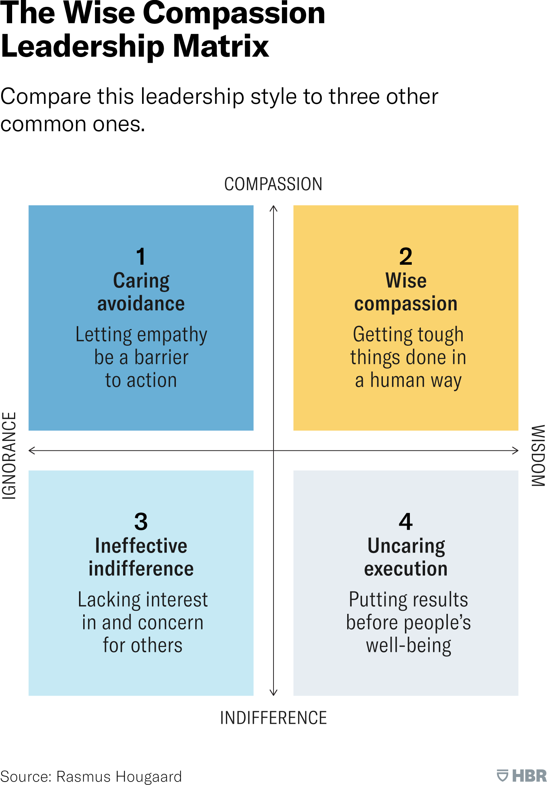

# El liderazgo compasivo

## El liderazgo compasivo, un camino hacia un mundo laboral más humano

#teoria
El liderazgo compasivo es la capacidad de hacer cosas difíciles de una manera humana, combinando la sabiduría de saber qué hacer con la compasión de cuidar a las personas impactadas por las decisiones y acciones. Este enfoque se basa en la comprensión de que los líderes tienen una gran responsabilidad hacia sus colaboradores y que el éxito a largo plazo depende de crear un entorno laboral donde las personas se sientan valoradas, respetadas y seguras.Las Bases del Liderazgo Compasivo:

**Reconocer la Humanidad Compartida:** El liderazgo compasivo parte de la premisa de que todos somos seres humanos con necesidades, deseos y experiencias similares. Esta perspectiva nos permite conectar con los demás a un nivel más profundo y comprender mejor sus perspectivas.

**Conectar con Empatía, Liderar con Compasión:** Si bien la empatía es importante para comprender las emociones de los demás, la compasión va un paso más allá al combinar la empatía con la acción.

**La presencia y la consciencia** son esenciales para este proceso. La presencia nos permite conectar con los demás en el momento presente, mientras que la consciencia nos ayuda a comprender nuestras propias emociones y las de los demás, permitiéndonos tomar decisiones y acciones más sabias y compasivas.

#imagen
 Fotografía en primer plano de dos pares de manos entrelazadas en gesto de apoyo y contención. Una persona sostiene las manos de otra sobre lo que parece ser una rodilla con pantalón vaquero. Transmite cercanía, cuidado y conexión humana.

---

## Conectar con empatía, liderar con compasión

#teoria
Es importante destacar que la compasión no se trata de complacer a los demás o darles siempre lo que quieren. La compasión puede ser firme y directa, como cuando se aborda el comportamiento inapropiado de una persona. La clave es que la intención detrás de la acción sea ayudar a esa persona a cambiar para lograr mejores resultados para todos.

**La empatía es la capacidad de sentir con otro ser.** Es la habilidad de comprender y compartir las emociones de los demás. La empatía es una cualidad humana valiosa, pero en el contexto del liderazgo puede tener sus desventajas.

**La compasión es una intención, mientras que la empatía es una emoción.** Sentir empatía por alguien que sufre puede llevar a un líder a asumir ese sufrimiento, lo cual no siempre es beneficioso. La compasión, en cambio, implica dar un paso atrás y preguntarse qué se puede hacer para apoyar a la persona que sufre.

**La compasión lleva a la acción, mientras que la empatía puede paralizar.** La empatía sin acción puede conducir a la "evasión cariñosa", donde los líderes evitan tomar decisiones difíciles por miedo a herir los sentimientos de los demás. La compasión, al estar orientada a la acción, permite a los líderes tomar decisiones difíciles, incluso cuando son dolorosas, con el objetivo de beneficiar a todos.

**La compasión se centra en el bien común, mientras que la empatía puede ser divisiva.** La empatía puede llevar a los líderes a favorecer a aquellos con quienes se sienten más conectados, creando divisiones dentro del equipo. La compasión, por otro lado, se centra en el bienestar de todos, buscando unir a las personas y promover la inclusión.

#imagen
 Gráfico de dos ejes titulado "Distinction between pity, sympathy, empathy, and compassion". Eje vertical: "Willingness to act to support". Eje horizontal: "Understanding of the other's experience". Muestra cuatro niveles ascendentes: Pity ("I feel sorry for you"), Sympathy ("I feel for you"), Empathy ("I feel with you"), Compassion ("I am here to help").

---

## Modelos de compasión sabia

#teoria
**The Wise Compassion Leadership Matrix**
Compare this leadership style to three other common ones.

#imagen
 Matriz 2x2 de Rasmus Hougaard (HBR). Ejes: vertical "COMPASSION-INDIFFERENCE", horizontal "IGNORANCE-WISDOM". Cuatro cuadrantes: (1) Caring avoidance - Letting empathy be a barrier to action, (2) Wise compassion - Getting tough things done in a human way, (3) Ineffective indifference - Lacking interest in and concern for others, (4) Uncaring execution - Putting results before people's well-being. Fuente: Rasmus Hougaard, HBR.

#imagen
 Diagrama circular "The Wise Compassion Flywheel" con cuatro elementos conectados: (1) Caring presence - Be here now, (2) Caring courage - Courage over comfort, (3) Caring candour - Direct is faster, (4) Caring transparency - Clarity is kindness. Fuente: Potential Project.

#explicacion
**Caring presence: be here now**
Leadership is about connection, and there is no possibility of connection if we are not present. When we are present, we are in the moment, giving the people around us our full attention. Mindfulness is a useful way to counter this tendency, helping us become more present with what is happening right now.

Three ways to practice caring presence:
1. Be curious and don't make assumptions
2. Let go of expectations
3. Use the power of the pause

**Caring courage: courage over comfort**
As human beings, we're hardwired to embrace certainty and safety and to avoid danger and discomfort. Overcoming our comfort-seeking orientation requires courage: the inner strength to overcome our fears or dreads about a situation so that we can take the action that is required.

Three ways to practice caring courage:
1. Have at least one courageous confrontation every day
2. Deal with things—never let them fester
3. Trust your intuition

**Caring candour: direct is faster**
As leaders, we need to find the middle ground between candour and care in order to create a culture that is both kind and straight-talking. Being direct and straightforward is always the fastest and most efficient way to engage in a conversation.

Three ways to practice caring candour:
1. Bottom line it first
2. Avoid the popularity game
3. Have zero tolerance for value-breakers

**Caring transparency: clarity is kindness**
Caring transparency means getting ideas and thoughts out in the open – making the invisible visible. It means being open and honest about where you stand and what awaits the organization.

Three ways to practice caring transparency:
1. Make time for connection
2. Encourage dissent
3. Show your true self

When we master the four elements of the Wise Compassion Flywheel, we also enable others to show up with presence, courage, candour and transparency. Over time this becomes our shared culture.

---

## Beneficios del liderazgo compasivo para líderes y equipos

#teoria
**Beneficios para los líderes:**

**Menos estrés y agotamiento:** Esto se debe a que la compasión les permite afrontar las situaciones difíciles con mayor ecuanimidad y resiliencia, evitando la sobrecarga emocional.

**Mayor bienestar y felicidad:** Esto se debe a que la compasión les permite conectar con un sentido de propósito y significado en su trabajo, lo que les genera una mayor satisfacción personal.

**Menor intención de renunciar:** Esto sugiere que la compasión fomenta un mayor compromiso y lealtad hacia la empresa.

**Mayor eficacia:** Los líderes compasivos se sienten más seguros de su capacidad para liderar a otros.

**Beneficios para los equipos:**

**Mayor satisfacción laboral:** Esto se debe a que la compasión crea un ambiente de trabajo más positivo y apoyo, donde las personas se sienten valoradas y respetadas.

**Mayor compromiso organizacional:** La compasión genera un sentimiento de pertenencia y lealtad hacia la empresa, lo que se traduce en un mayor esfuerzo y dedicación por parte de los empleados.

**Mejor rendimiento:** El liderazgo compasivo se asocia con un mejor rendimiento laboral de los empleados. Esto se debe a que la compasión fomenta la motivación, la colaboración y la innovación, creando un entorno donde las personas se sienten seguras para tomar riesgos y dar lo mejor de sí mismas.

**Menor agotamiento:** Los empleados que trabajan para líderes compasivos experimentan menos de agotamiento. Esto se debe a que la compasión crea un ambiente de trabajo más saludable y equilibrado, donde las personas se sienten apoyadas y protegidas.

#explicacion
Datos de investigación:
- Los líderes que se califican a sí mismos como altamente compasivos reportan un 66% menos de estrés y un 63% menos de agotamiento que sus contrapartes menos compasivos.
- Los líderes compasivos tienen una intención 200% menor de renunciar a su organización.
- Los empleados que perciben a su líder como compasivo tienen un 34% más de satisfacción laboral.
- Los empleados que experimentan un liderazgo compasivo muestran un 36% más de compromiso con la organización.
- Los empleados que trabajan para líderes compasivos experimentan un 22% menos de agotamiento.
- Los colaboradores cuyos líderes muestran una preferencia por la compasión están un 25% más comprometidos con sus trabajos.
- Los colaboradores de líderes compasivos tienen un riesgo 11% menor de agotamiento.
