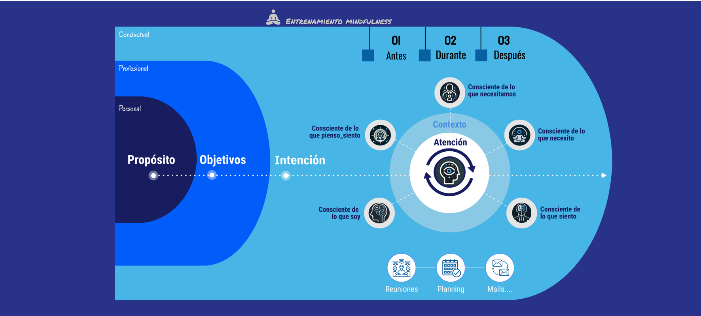

# Modelo para orientar acciones y decisiones con consciencia

#imagen
 Diagrama del modelo completo sobre fondo azul. A la izquierda, óvalo con tres niveles concéntricos etiquetados "Conductual", "Profesional" y "Personal", conteniendo una línea temporal con tres hitos: "Propósito" (azul oscuro), "Objetivos" (verde) e "Intención" (amarillo). En la parte superior, icono de meditación con texto "ENTRENAMIENTO MINDFULNESS". A la derecha, tres indicadores de fase: "01 Antes", "02 Durante", "03 Después". En el centro-derecha, círculo con "Contexto" y "Atención" en el núcleo (icono de cabeza con flechas circulares), rodeado por cinco módulos anteriores: "Consciente de lo que necesitamos" (arriba), "Consciente de lo que necesito" (derecha superior), "Consciente de lo que siento" (derecha inferior), "Consciente de lo que soy" (abajo izquierda), "Consciente de lo que pienso_siento" (izquierda). En la parte inferior, tres iconos representando aplicaciones: "Reuniones", "Planning", "Mails...".
