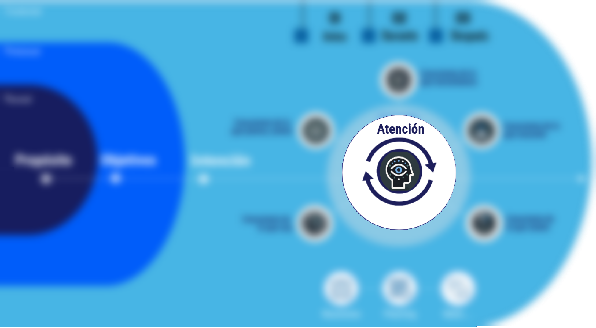
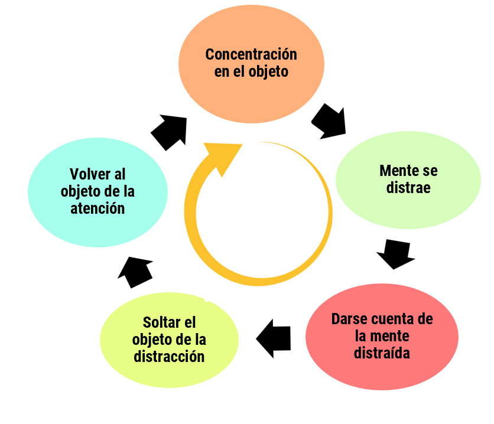

# La atención como guía que debe mantener la consciencia en todo momento presente en el momento

#imagen
 Fragmento del modelo mostrando el área central de "Atención" con icono de cabeza y flechas circulares, destacando la importancia de la atención consciente.

#imagen
 Señal de advertencia "ATENCIÓN" con signo de exclamación, simbolizando la alerta necesaria para mantener la consciencia presente.

#teoria
- El diseño actual de la tecnología busca captar y mantener nuestra atención a toda costa, incluso si esto significa explotar nuestras debilidades y fomentar la distracción. Las redes sociales y las aplicaciones están diseñadas para ofrecer recompensas frecuentes, incitarnos a la multitarea, personalizar el contenido para mantenernos enganchados. Explotan el sistema de recompensas del cerebro (dopamina) para mantenernos enganchados a sus plataformas.
- **El tiempo promedio de atención en una tarea o pantalla ha caído drásticamente**: de 150 segundos en 2004 a apenas 47 segundos en la actualidad.
- El tiempo diario en email, que ha pasado de 47 minutos en 2004 a 83 minutos en 2016
- Hacemos click, deslizamos o tocamos el móvil 2.617 x/día
- **El Mito de la Multitarea**: El neurocientífico Earl Miller afirma que el cerebro humano solo puede procesar uno o dos pensamientos a la vez de manera consciente. La "multitarea" en realidad es una rápida alternancia entre tareas, lo que genera un alto costo cognitivo.

#explicacion
Disminución de la duración de la atención: Attention Span, Gloria Mark. El tiempo promedio de atención en una tarea o pantalla ha caído drásticamente: de 150 segundos en 2004 a apenas 47 segundos en la actualidad. El tiempo diario en email, que ha pasado de 47 minutos en 2004 a 83 minutos en 2016. Hacemos click, deslizamos o tocamos el móvil 2.617 x/día.

El diseño actual de la tecnología, basado en el "capitalismo de vigilancia", busca captar y mantener nuestra atención a toda costa, incluso si esto significa explotar nuestras debilidades y fomentar la distracción. Las redes sociales y las aplicaciones están diseñadas para ofrecer recompensas frecuentes, incitarnos a la multitarea, personalizar el contenido para mantenernos enganchados. Explotan el sistema de recompensas del cerebro para mantenernos enganchados a sus plataformas. Es importante destacar que la dopamina es un neurotransmisor clave en el sistema de recompensas, y su liberación se asocia con la sensación de placer y satisfacción. La tecnología, con sus notificaciones, likes y actualizaciones constantes, puede estar manipulando este sistema para liberar dopamina y generar una sensación de adicción.

El Mito de la Multitarea: El autor argumenta que la idea de que podemos realizar múltiples tareas al mismo tiempo de manera efectiva es un mito. Cita al neurocientífico Earl Miller, quien afirma que el cerebro humano solo puede procesar uno o dos pensamientos a la vez de manera consciente. La "multitarea" en realidad es una rápida alternancia entre tareas, lo que genera un alto costo cognitivo.

---

#imagen
 Diagrama circular con los 4 componentes de la atención: "Concentración en el objeto" (arriba), "Mente se distrae" → "Darse cuenta de la mente distraída" (derecha), "Soltar el objeto de la distracción" (abajo), "Volver al objeto de la atención" (izquierda). Flechas conectan los componentes en ciclo.

#teoria
- ATENCIÓN SOSTENIDA
- ORIENTACIÓN
- ALERTA
- CONTROL EJECUTIVO

---

#imagen
 Ilustración comparativa: un láser representando "1. La atención centrada" apuntando a un punto con texto "PRESENTE", y un foco representando "2. La atención abierta" iluminando un área amplia.
