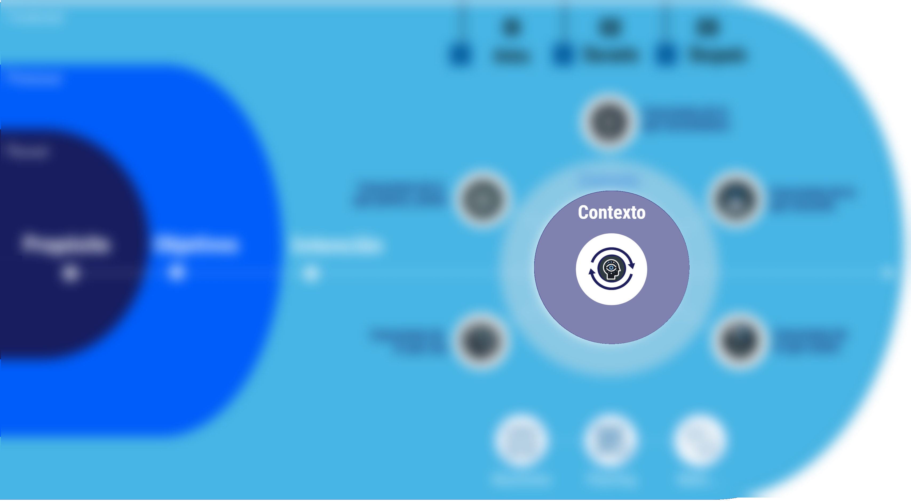

# Consciencia sobre el contexto y su naturaleza cambiante y las reacciones automáticas generadas

#imagen
 Fragmento del modelo mostrando el área central con "Contexto" destacado en círculo morado, con icono de cabeza y flechas circulares en el centro.

#teoria
La combinación de la atención focalizada y la monitorización abierta en el mindfulness es una herramienta poderosa para un liderazgo adaptativo:

- **Atención Hacia Fuera (Adaptación al Contexto Cambiante):** La monitorización abierta permite percibir y reaccionar a eventos externos que podrían estar afectando el contexto de trabajo. La atención focalizada ayuda a observar las señales más sutiles en el entorno, mientras que la monitorización abierta permite captar cualquier indicio de cambio en el equipo o en el entorno

- **Atención Hacia Dentro (Autogestión Emocional y Respuesta Adaptativa):** La atención focalizada y la monitorización abierta también ayudan a observar las propias reacciones internas, como sensaciones y emociones, que pueden influir en sus decisiones y comportamientos. Al monitorear continuamente su estado interno, se puede reconocer cuándo surge una respuesta emocional automática —como frustración o ansiedad— que podría afectar al juicio. Esta autoconciencia permite gestionar mejor las reacciones, evitando respuestas automáticas y poco adaptativas.
